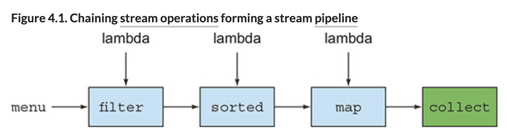
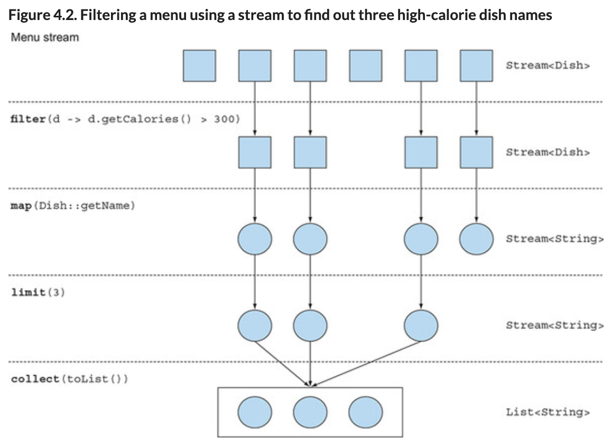
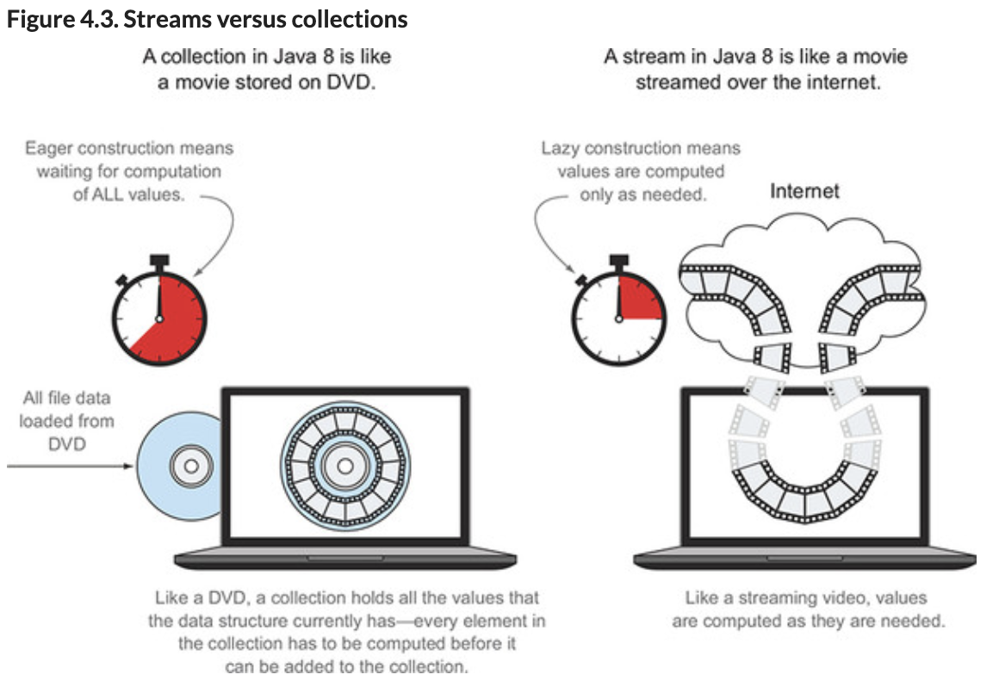
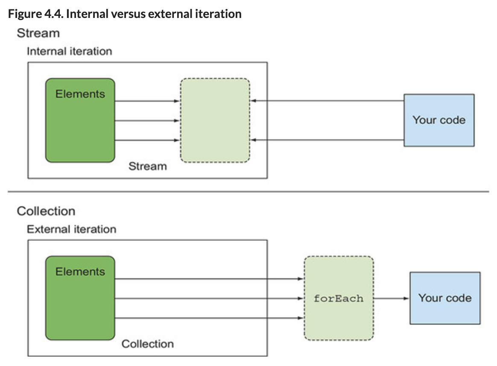
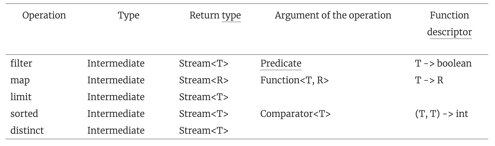
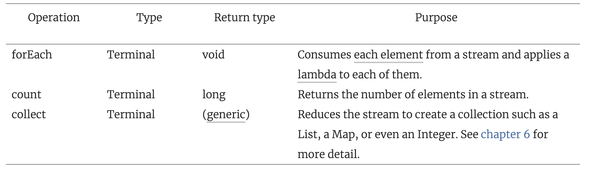

# Chapter4# 스트림 소개

## 1. 스트림이란 무엇인가 
- JAVA 8 API에 새로 추가된 기능이다.  
스트림을 사용하면 선언형으로 컬렉션 데이터를 처리할 수 있다.     
또한 멀티스레드를 구현하지 않아도 데이터를 '투명하게(?)'병렬 처리할 수 있다.  

- 기존코드와 비교해보자     
: 저칼로리의 요리를 반환하고, 칼로리 기준으로 정렬하는 자바 코드

AS-IS 코드 (java 7)
```java
List<Dish> lowCaloricDishes = new ArrayList<>();
for(Dish dish: menu) {
    if(dish.getCalories() < 400) {
        lowCaloricDishes.add(dish);
    }
}

Collections.sort(lowCaloricDishes, new Comparator<Dish>() {
    public int compare(Dish dish1, Dish dish2) {
        return Integer.compare(dish1.getCalories(), dish2.getCalories());
    }
});

List<String> lowCaloricDishesName = new ArrayList<>();
for(Dish dish: lowCaloricDishes) {
    lowCaloricDishesName.add(dish.getName());
}
```
- 위 코드에서는 lowCaloricDishes라는 'gerbage변수'를 사용했다.    
자바 8에서는 이러한 세부구현을 라이브러리로 제공한다.   


TO-BE 코드 (java 8)
```java
List<String> lowCaloricDishesName =
               menu.stream()              
               //menu.parallelStream()       //병렬처리 가능
                   .filter(d -> d.getCalories() < 400)      //400칼로리 이하 요리 선택
                   .sorted(comparing(Dish::getCalories))    //칼로리로 요리 정렬
                   .map(Dish::getName)                      //요리 명 추출
                   .collect(toList());                      //요리명을 리스트로 저장
```

-  선언형으로 코드를 구현 할 수 있다.  
-> 즉, 루트와 if조건문 제어 블록 없이 '저칼로리 요리를 선택하라' 같은 동작 수행이 가능하다. 

- 그림 4-1 에서 처럼 filter, sorted, map, collection과 같은 블록연산을 연결해 복잡한 데이터의 처리 파이프라인을 만들 수 있다.     
여전히 가독성과 명확성은 유지된다. 각 결과가 순차적으로 메서드로 연결된다.   
filter, sorted, map, collection등의 연산은 high-level building block으로 이루어져 있으므로 특정 스레드 모델에 제한되지않고 사용이 가능하다.   
따라서 우리는 처리과정을 병렬화 하면 스레드와 락에 대해 신경쓰지 않아도 된다. 



- 결과적으로 우린 아래와 같은 코드를 작성할거고 아래과 같은 결과를 포함할 것이다. 
```java
Map<Dish.Type, List<Dish>> dishesByType =
    menu.stream().collect(groupingBy(Dish::getType));
```

```java
{
    FISH=[prawns, salmon],
    OTHER=[french fries, rice, season fruit, pizza],
     MEAT=[pork, beef, chicken]
}
```

- 자바 8 스트림 API의 특징은 다음과 같다.  
 선언형 : 간결하고 가독성이 좋아진다.  
 조립할 수 있음 : 유연성이 좋아진다.   
 병렬화 : 성능이 좋아진다. 

 - 아래 menu를 사용하여 예제를 진행한다. 
```java
 List<Dish> menu = Arrays.asList(
    new Dish("pork", false, 800, Dish.Type.MEAT),
    new Dish("beef", false, 700, Dish.Type.MEAT),
    new Dish("chicken", false, 400, Dish.Type.MEAT),
    new Dish("french fries", true, 530, Dish.Type.OTHER),
    new Dish("rice", true, 350, Dish.Type.OTHER),
    new Dish("season fruit", true, 120, Dish.Type.OTHER),
    new Dish("pizza", true, 550, Dish.Type.OTHER),
    new Dish("prawns", false, 300, Dish.Type.FISH),
    new Dish("salmon", false, 450, Dish.Type.FISH) );
```
- Dish는 불변형 클래스이다. 
```java
    public class Dish {
    private final String name;
    private final boolean vegetarian;
    private final int calories;
    private final Type type;
    public Dish(String name, boolean vegetarian, int calories, Type type) {
        this.name = name;
        this.vegetarian = vegetarian;
        this.calories = calories;
        this.type = type;
    }
    public String getName() {
        return name;
    }
    public boolean isVegetarian() {
        return vegetarian;
    }
    public int getCalories() {
        return calories;
    }
    public Type getType() {
        return type;
    }
    @Override
    public String toString() {
        return name;
    }
    public enum Type { MEAT, FISH, OTHER }
}
```
----
## 2. 스트림 시작하기 

- 스트림이란?     
'데이터 처리 연산을 지원하도록 소스에서 추출된 연속된 요소 (Sqeuence of elements)'로 정의 가능하다. 

- 스트림의 정의 
> - 연속된 요소  
  컬렌션과 마찬가지로 스트림은 특정 요소 형식으로 이루어진 연속된 집합의 인터페이스를 제공한다.   
  컬렉션은 자료구조이므로 시간과 공간 복잡성과 관련된 요소 저장 및 접근 연산이 주를 이룬다. (ArrayList vs LinkedList)  
  반면에 스트림은 filter, sorted, map과 같이 표현 계산식이 주를 이룬다.   
  즉, 컬렉션의 주제는 데이터이고 스트림의 주제는 계산이다.   

> - 소스  
스트림은 컬레션, 배열, I/O 자원 등 데이터 제공 소스로부터 데이터를 소비한다.   
정렬된 컬렉션으로 스트림을 소비하면 정렬이 그대로 유지된다.    

> - 데이터 처리 연산   
스트림은 함수형 프로그래밍 언어에서 일반적으로 지원하는 연산과 데이버 베이스와 비슷한 연산을 지원한다.  
예를 들어 filter, map, reduce, find, match, sort 등으로 데이터를 조작 가능하다.  
또한, 스림은 순차적 또는 병렬루 실행  할 수 있다. 

- 스트림의 특징 
> - 파이프 라이닝 (Pipelining) 
  대부분의 스트림 연상는 스트림끼리 연결해서 커다란 파이프라인을 구성할 수 있도록 스트림 자신을 반환한다.  
  그 결과 laxuness, short-circuting과 같은 최적화를 얻을 수 있다. (5장 참고)  
  연산 파이프라인은 데이터 소스에 적용하는 데이터베이스 질의와 비슷하다.    

> - 내부 반복  
반복자를 이용해서 병시적으로 반복하는 컬렉션과는 달리 스트림은 내부 반복을 지원한다. (4장 3.2 참고)

- 예제로 위 설명 내용을 촥인하자 
```java
import static java.util.stream.Collectors.toList;
List<String> threeHighCaloricDishNames =
    menu.stream()                                   // 1. 메뉴에서 스트림을 얻는다
        .filter(dish -> dish.getCalories() > 300)   // 2. 파이프라인 연산 만들기 (1)고칼로리 필터링
        .map(Dish::getName)                         //                     (2)요리명 추출
        .limit(3)                                   //                     (3) 선착순 3개만 선택
        .collect(toList());                         // 3. 결과를 다른 리스트로 저장
System.out.println(threeHighCaloricDishNames);      
```
- 우선 요리 리스트를 포함하는 메뉴에 stream메서를 호출해 스트림을 얻었다.   
  여기서 데이터 소스는 요리 리스트(메뉴)이다. 데이서 소스는 연속된 요소를 스트림에 제공한다.  
  다음으로 스트름에 filter, map, limit, collection 으로 이어지는 일련은 데이터처리 연산을 제공한다. 

- collect을 제되한 모든 연산은 서로 파이프라인을 형성 할 수 있도록 스트림을 반환한다.   
  파이프 라인은 소스세 적용하는 질의 같은 존재다. 

- 마지막으로 collect 연산으로 파이프라인을 처리해서 결과를 반환한다. (Stream이 아닌 List를 반환한다.  
collect을 호출 하기 전 까지는 아무것도 선택되지않고, 출력결과 값도 없다. 

- 각 연산은 다음 작업을 수행한다. 
> - filter
  람다를 인수로 받아 스트림에서 특정 요소를 제외시킨다.   
  위 예제에서는 dish -> dish.getCalories() > 300 라는 람다를 전달하여 300칼로리 이상의 요리를 선택한다. 

> - map  
람다를 이용해서 한 요소를 다른 요소로 변환하거나 정보를 추출한다.   
예제에서는 메서드 참조 Dish::getName (dish -> dish.getName())을 전달해서 각 요리명을 추출한다. 

> - limit   
 정해진 갯수 이상의 요소가 스트림에 저장되지 못하게 스트림의 갯수를 축소한다.

> - collection   
스트림을 다른 형식으로 변환한다.  
예제에서는 스트림을 리스트로 변환했으며 toList()는 스트림을 리스트로 변환하라고 지시하는 인자이다. 



- 자바8 이전과 비교해서 생각해보자   
- 우선 '고칼로리 요리 이름 3개를 찾아라'처럼 좀 더 선언형으로 데이터를 처리 할 수 있다.   
스트림 라이브러리에서 필터링, 추출, 축소 기능을 제공하므로 직접 기능을 구현 할 필요가 없다. 

----
## 3. 스트림과 컬렉션

- 자바의 컬렉션과 스트림 모두 연속된 요소 형식의 값을 저장하는 자료구조의 인터페이스를 제공한다.    
  여기서 연속된(sequenced) 이라는 표현은 순서와 상관없이 아무 값에나 접속하는것이 아닌 순차적으로 값에 접근하는것을 의미한다.   
이제 컬렌션과 스트림의 차이를 알아보자

- 쉽게 설명하면 컬렌션은 DVD에 저장된 영화이고 스트림은 인터넷으로 스트리밍 되는 영화이다. 




- 데이터를 **언제** 계산 하느냐가 컬렌션과 스트림의 가장 큰 차이다.  
컬렌션은 현재 자료구조가 포함하는 **모든** 값을 메모리에 저장하는 자료구조이다.  
즉, 컬렌션의 모든 요소는 컬렉션에 추가되기 이전에 계산되어야 한다.   

- 반면 스트림은 이론적으로 **요철할 때만 요소를 계산**하는 고정된 자료구조이다. (스트림에 요소를 추가하거나 스트림에 요소를 제거 할 수 없다)  
사용자가 요청한 값만 스트림에서 추출 한다는 것이 핵심이다.  물론 사용자는 이러한 변화를 알 수 없다.    
스트림은 생산자와 소비자의 관계를 형성한다. 또한, 스트림은 게으르게 만들어지는 컬렌션과 같다.   
사용자가 요청할 때만 값을 계산한다, (요청중심 제조, 즉석 제조)

- 반면 걸렉션은 적극적으로 생성된다(생산자 중심 : 팔기도 전에 창고를 가득 채운다.)


### `3.1 딱 한번만 탐색 할 수 있다.`
- 반복자와 마찬가지로 스트림도 한번만 탐색 할 수 있다. 즉, 탐색된 스트림으 요소는 소비된다. 
- 한번 탐색된 요쇼를 다시 탐색하려면 초기 데이터 소스에서 새로운 스트림을 만들어야 한다.   
- 그러기 위해서는 컬렌션처럼 반복사용할 수 있는 데이터 소스여야하나, 데이터 소스가 IO채널인 경우는 재사용이 불가하다. 

```java
List<String> title = Arrays.asList("Modern", "Java", "In", "Action");
Stream<String> s = title.stream();
s.forEach(System.out::println);     //title의 각 단어를 출력
s.forEach(System.out::println);     //java.lang.IllegalStateException 발생, 스트림이 소비되었거다 닫혔다!
```


### `3.2 외부 반복과 내부 반복`
- 컬렉션 인터페이스를 사용하려면 사용자가 직접 요소를 반복(for-each구문 사용 등)해야 한다. 이를 외부반복이라고 한다. 
- 반면 스트림 라이브러리는 내부반복을 사용하낟. 
- 함수에서 어떤작업을 수행할지만 지정하면 모든것이 알아서 처리된다. 

```java
List<String> names = new ArrayList<>();
Iterator<String> iterator = menu.iterator();
while(iterator.hasNext()) {
    Dish dish = iterator.next();
    names.add(dish.getName());
}
```

- for each를 이용하면 Iterator객체를 사용 할때 보다는 쉽게 컬렉션을 반복할 수 있다.

```java
List<String> names = new ArrayList<>();
for(Dish dish: menu) {              //메뉴 리스트를 명시적으로 순차 반복하낟. 
    names.add(dish.getName());      //이름을 추출해서 리스트에 추가한다. 
}
```

- stream을 이용해서 반복자도 사용하지 않을 수 있다. 

```java
List<String> names = menu.stream()
                         .map(Dish::getName)        //map메서드를 getName메서드로 파리미터화 해서 요리명을 추출
                         .collect(toList());        //파이프라인을 실행한다. 반복자 필요없음 

```

- 외부반복과 내부반복이 어떤 차이와 장점이 있는지 아래 예제로 확인해보자 
- 외부 반복은 아래와 같이 진행된다. 
> Q: "장남감 정리좀 하렴 방바닥에 장남감이 있지"  
> A: "네, 공이있어요."  
> Q: "공을 상자에 담으렴 또 어떤 장난감이 있니?"  
> A: "인형이있어요."  
> Q: "인형을 상자에 담으렴 또 어떤 장난감이 있니?"  
> A: "책이있어요."  
> Q: "책을 상자에 담으렴 또 어떤 장난감이 있니?"  
> A: "아무것도 없어요."  
> Q: "잘했어"

- 장난감을 모두 상자에 담으렴 이라고 하면 훨씬 편할것이다.
- 하지만, 아이가 한손에 인형과 공을 모두 잡으루 있고 모든 장난감을 상자가까이 이동시킨 뒤 넣는다면 훨씬 효율 적일 것이다. 
- 내부반복을 이용하면 작업을 투명하게 병렬로 처리하거나, 
- 스트림의 내부 라이브러리는 병렬구현을 자동으로 선택한다 반면에 for-each는 사용자가 병렬성을 스스로 관리해야 한다  
: 병렬자체를 포기하던지, synchroized로 시작하는 겁나 긴 소스를 작성해야 한다.

- 내부반복과 외부반복 차이



----
## 4. 스트림 연산 
- java.util.stream.Stream 인터페이스에는 다양한 연산이 있으며 크게 두가지로 구분 가능하다.

```java
List<String> names = menu.stream()
                         .filter(dish -> dish.getCalories() > 300) //중간연산
                         .map(Dish::getName) //중간연산
                         .limit(3) //중간연산
                         .collect(toList()); //스트림을 리스트로 변환
```
- filter, map, limit는 서로 연결되어 파이프라인을 형성한다.  
 collection은 파이프라인을 실행한 뒤 닫는다.

- 연결할 수 있는 스트림 연산을 중간연산(intermediate operation) 이라고 하며,  
스트림을 닫는 연산을 최종연산(terminal operation)이라고 한다. 

### `4.1 중간연산`

- filter나 sorted같은 중간연산은 다른 스트림을 반환하므로 여러 중간연산을 연결해서 질의를 만들 수 있다.
- 중간연산의 특징은 각각의 연산은 스트림 파이프라인이 실행되지전까지 수행하지 않는다. 

- 아래 코드를 이용해서 확인해보자 
```java
List<String> names =
    menu.stream()

        .filter(dish -> {
                          System.out.println("filtering:" + dish.getName());
                          return dish.getCalories() > 300;
                     })
        .map(dish -> {
                       System.out.println("mapping:" + dish.getName());
                       return dish.getName();
                  })
        .limit(3)
        .collect(toList());
System.out.println(names);
```
- 결과는 다음과 같다.
- 스트림의 lazy 특성으로 300칼로리가 넘는 요리가 여러개지만 3개만 선택되었다.(short-circuiting)
- 또한, filter와 map은 다른 연산이지만 하나로 병합되었다. (loop fusion)
```
filtering:pork
mapping:pork
filtering:beef
mapping:beef
filtering:chicken
mapping:chicken
[pork, beef, chicken]
```
### `4.2 최종 연산`
- 최종연산은 스트림 파이프에서 결과를 도출한다. 
- 주로 void, List, Integer등 스트림 외의 결과가 반환된다.
```java
menu.stream().forEach(System.out::println);
```

### `4.3 스트림 이용하기`
- 스트림 이용과정
```
- 질의를 수행할 데이터소스 (ex 컬렉션 등)
- 스트림 파이프라인을 구성항 중간 연산 연결
- 스트림 파이프라인을 실행하고 결과를 만들 최종 연산
```
- 스트림 파이프라인 개념은 빌더패선과 비슷하다. 
- 빌더패턴은 호출을 연결해서 설정을 만들고(연결연산) bulid를 메서드(최종연산)를 호출한다.

- 주요 중간연산 

- 주요 최종연산
