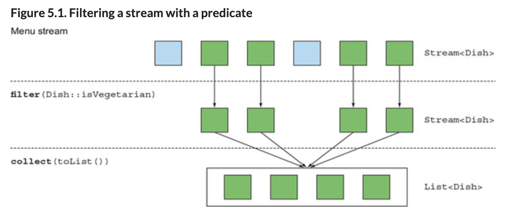
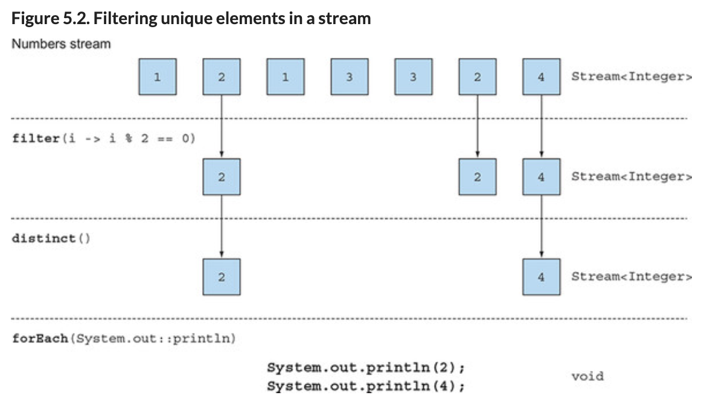
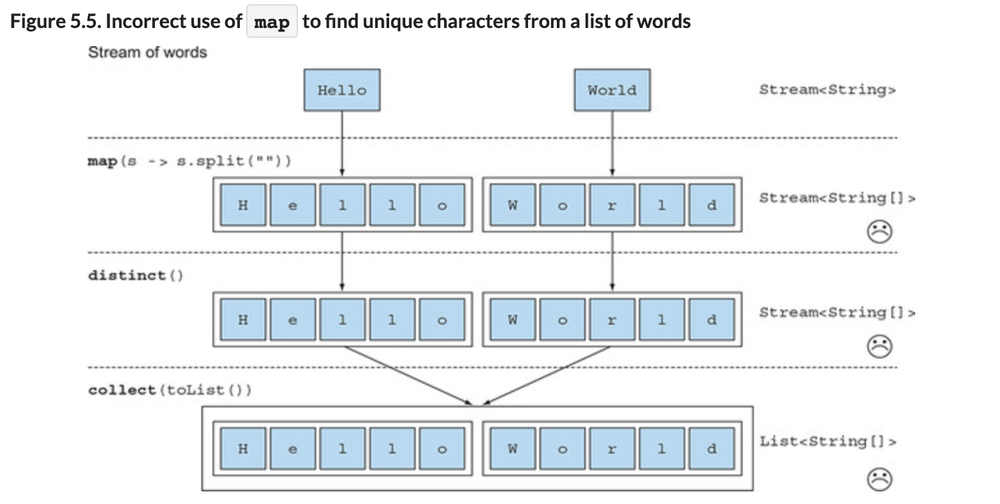
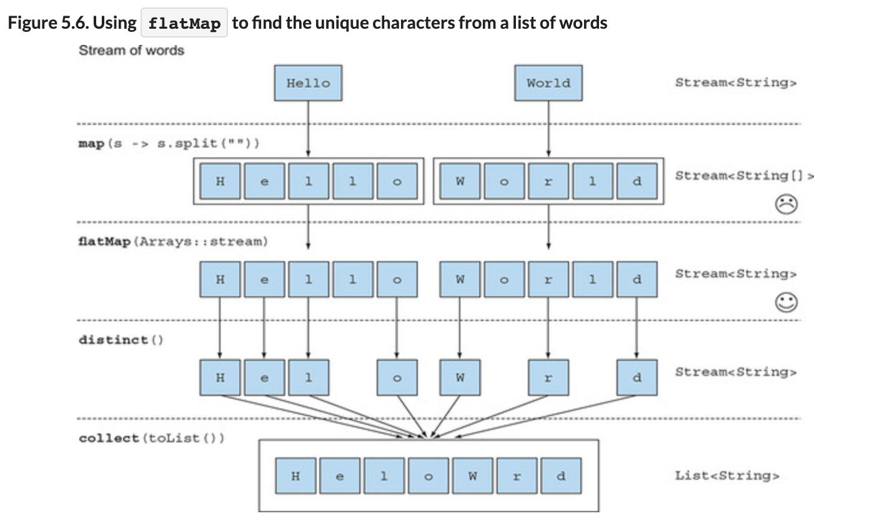
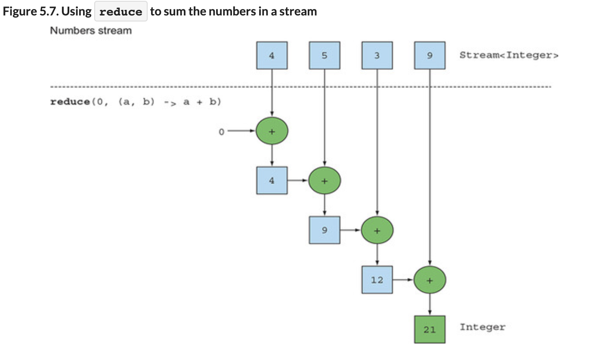
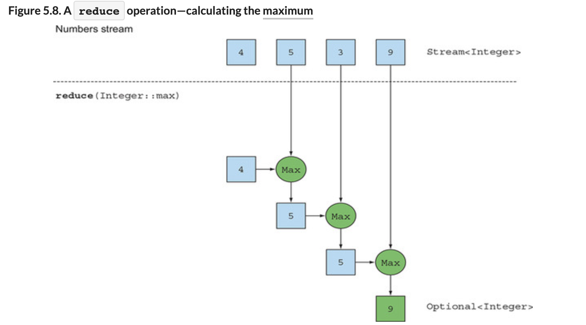
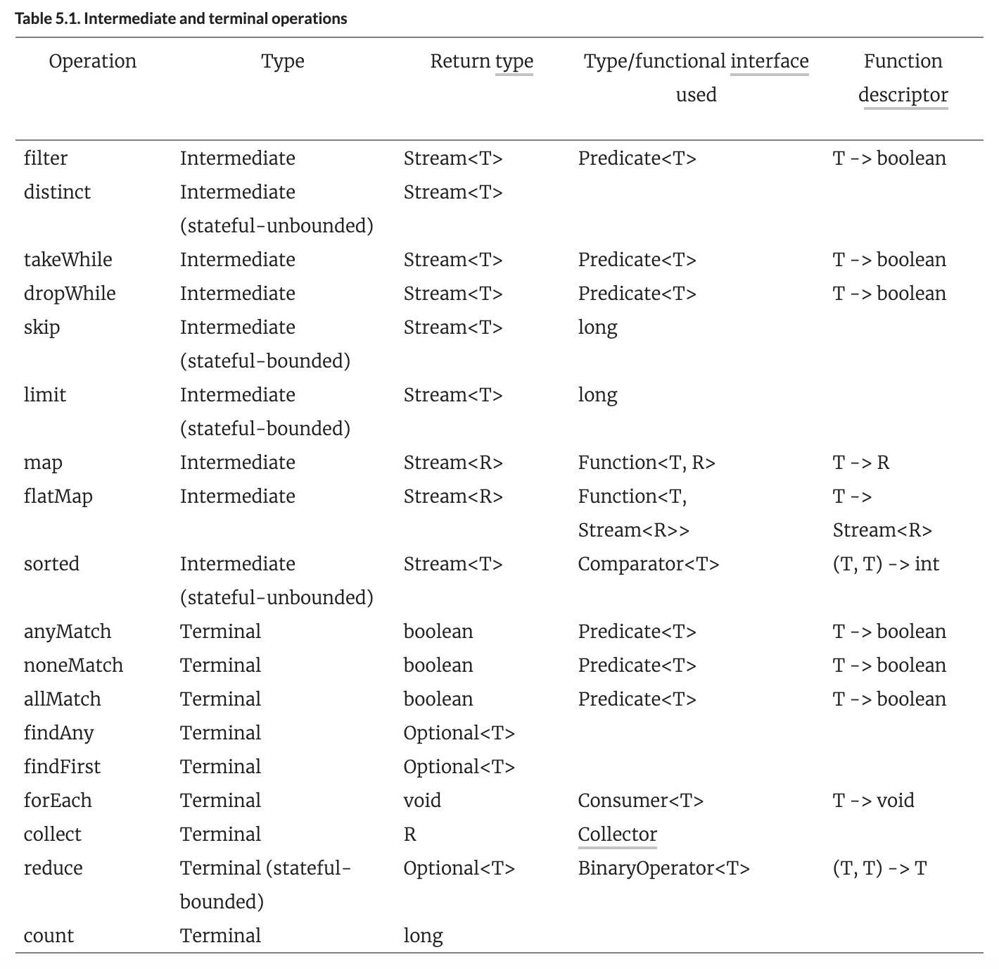

# Chapter5# 스트림 활용


## 1. 필터링

### `1.1 Predicate로 필터링`
- filter 메서드는 predicate(return boolean)를 인수로 받아서 predicate와 일치하는 요소를 포함하는 스트림을 반환하낟. 
- 예제 소스
```java
List<Dish> vegetarianMenu = menu.stream()
                                .filter(Dish::isVegetarian)
                                .collect(toList());
```


### `1.2 Distinct`

- 스트림은 고유 요소로 이루어진 스트림을 반환하도록 discinct 메서드를 지원한다. 
- 고유 요소는 스트림에서 만든 객체의 equal, hashcode가 결정한다.
- 예제 소스
```java
List<Integer> numbers = Arrays.asList(1, 2, 1, 3, 3, 2, 4);
numbers.stream()
       .filter(i -> i % 2 == 0)
       .distinct()
       .forEach(System.out::println);
```


-----
## 2. 스트림 슬라이싱

### `2.1 Predicate를 이용한 슬라이싱`

- 다음과 같은 요리 목록이 있다고 가정한다.
```java
List<Dish> specialMenu = Arrays.asList(
    new Dish("seasonal fruit", true, 120, Dish.Type.OTHER),
    new Dish("prawns", false, 300, Dish.Type.FISH),
    new Dish("rice", true, 350, Dish.Type.OTHER),
    new Dish("chicken", false, 400, Dish.Type.MEAT),
    new Dish("french fries", true, 530, Dish.Type.OTHER));
```
- **`TAKEWHILE`**
- 320 칼로리 이하의 목록을 선택해보자 -> filter를 통해 가능하다. 
```java
List<Dish> filteredMenu
    = specialMenu.stream()
                 .filter(dish -> dish.getCalories() < 320)
                 .collect(toList());
```
- 위 리스트는 이미 칼로리순으로 정렬되어있으므로 320보다 크거나 같은요리가 나왔을때 반복작업자체를 중단해 버리면 된다.
- 큰 크기의 스트림에서는 성능차이가 많이 날 수 있다. 
```java
List<Dish> slicedMenu1
    = specialMenu.stream()
                 .takeWhile(dish -> dish.getCalories() < 320)
                 .collect(toList());
```

- **`DROPWHILE`**
- TAKEWHILE과 반대로 나머지 요소를 선택한다
- 320칼로리보다 큰 요소 선택하기 
```java
List<Dish> slicedMenu2
    = specialMenu.stream()
                 .dropWhile(dish -> dish.getCalories() < 320)
                 .collect(toList());
```

### `2.2 스트림 축소`
- 주어진 값 이하의 크기를 갖는 새로운 스트림을 반환하는 limit(n) 메서드
- 스트림이 정렬되어 있는 경우, 정렬되지 않은 경우 둘다 사용가능하다 > 최대 n개 요소를 반환한다.
- filter와 limit 조합 예제
```java
List<Dish> dishes = specialMenu
                        .stream()
                        .filter(dish -> dish.getCalories() > 300)
                        .limit(3)
                        .collect(toList());
```


### `2.3 요소 건너뛰기`
- 처음 n개 요소를 제외한 스트림을 반환하는 skip(n)메서드
- n개 이하의 요소가 있는 스트림에 skip(n)을 호출하면 빈 스트림이 반환된다.
- 300칼로리 이상 요리를 처음 2개를 건너 뛰고 반환하는 예제
```java
List<Dish> dishes = menu.stream()
                        .filter(d -> d.getCalories() > 300)
                        .skip(2)
                        .collect(toList());
```

----
## 3. 매핑

### `3.1 각 요소에 함수 적용하기`
- 스트림은 함수를 인수로 받는 map 메서드를 제공한다.
- 인수로 제공된 함수는 각 요소에 적용되며, 함수를 적용한 결과가 새로운 요소로 매핑된다.
- 기존의 값을 고치를 것이 아닌 새로운 버전은 만드는 개념으로 '변환'의 의미와 가깝다.

- Dish::getName을 map메서드로 전달 -> 요리명을 추출하는 예제
```java
List<String> dishNames = menu.stream()
                             .map(Dish::getName)
                             .collect(toList())
```
- getName이 문자열을 반환하므로 출력스트림은 Stream<String>형식이다. 

- 요리명의 길이를 반환하는 예제 (map 메서드를 연결하여 사용)
```java
List<Integer> dishNameLengths = menu.stream()
                                   .map(Dish::getName)
                                   .map(String::length)
                                   .collect(toList());
```


### `3.2 스트림 평면화`
- ["Hello," "World"] 라는 리스트를 ["H," "e," "l," "o," "W," "r," "d"] 로 반환하도록 예제를 짜보자
```java
words.stream()
     .map(word -> word.split(""))
     .distinct()
     .collect(toList());
```


- 위 예제는 Stream<String[]> (문자열 배열)을 반환한다. 
- 우리가 원하는 방식은 Stream<String>이다

- **`map과 Array.stream 활용`**

- 문자열을 받아 stream을 만드는 Array.stream메서드가 있다. 
```java
String[] arrayOfWords = {"Goodbye", "World"};
Stream<String> streamOfwords = Arrays.stream(arrayOfWords);
```
- 위 예제 파이프라인에 Arrays.stream()메서드를 적용해보자.
- 결과적으로 List<Stream<String>>이 만들어지므로 문제는 해결되지 않는다.  
- 결국 각 단어를 개별 문자로 이루어진 배열로 만든뒤, 각 배열을 별도의 스트림으로 만들어야한다. 
```java
words.stream()
     .map(word -> word.split(""))
     .map(Arrays::stream)
     .distinct()
     .collect(toList());
```


- **`flatMap 사용`**

```java
List<String> uniqueCharacters =
  words.stream()
       .map(word -> word.split("")) //<- 각 단어의 개별문자를 포함하는 배열로 변환
       .flatMap(Arrays::stream) // <- 생성된 스트림을 하나의 스트림으로 평면화
       .distinct()
       .collect(toList());
\
```
- faltMap은 각 배열을 스트림이 아닌 스트림의 콘텐츠로 매핑한다.
- map(Arrays::stream)과 달리 flat맵읜 하나의 평면화 된 스트림을 반환한다.
- 즉, flatMap은 스트림의 각 값을 다른 스트림으로 만들뒤 모든 스트림을 하나로 연결하는 작업을 한다. 

----
## 4. 검색과 매칭
- 특정 속성이 데이터집합에 있는지 확인한다. 
- allMatch, anyMatch, noneMatch, findFirst, findAny등 메서드가 제공된다. 

### `4.1 적어도 한 요소와 일치하는지 확인`
- **`anyMatch`**
- menu에 채식요리가 있는지 확인 
- anyMatch는 boolean을 반환하는 최종연산이다. 
```java
if(menu.stream().anyMatch(Dish::isVegetarian)) {
    System.out.println("The menu is (somewhat) vegetarian friendly!!");
}
```

### `4.2 모든 요소가 일치/불일치하는지 확인`

- **`allMatch`**
- menu에 모든 요리가 1000칼로이 이하인지 확인
```java
boolean isHealthy = menu.stream()
                        .allMatch(dish -> dish.getCalories() < 1000);
```

- **`noneMatch`**
```java
boolean isHealthy = menu.stream()
                        .noneMatch(d -> d.getCalories() >= 1000);
```

- anyMatch, allMatch, noneMatch는 쇼트서킷 기법 연산을 활용한다.


### `4.3 요소 검색`

- **`findAny`**
- findAny는 현재 스트림에서 임의의 요소를 반환한다.
- findAny는 다른 스트림 연산과 연결해서 사용할 수 있다.
```java
Optional<Dish> dish =
  menu.stream()
      .filter(Dish::isVegetarian)
      .findAny();
```

### `4.4 첫번째 요소 찾기`
- 스트림이 정렬되어 있을때 첫번째 요소를 찾아보자
- 숫자 리스트에서 3으로 나누어 떨어지는 첫번째 제곱값을 찾는 예제
```java
List<Integer> someNumbers = Arrays.asList(1, 2, 3, 4, 5);
Optional<Integer> firstSquareDivisibleByThree =
  someNumbers.stream()
             .map(n -> n * n)
             .filter(n -> n % 3 == 0)
             .findFirst(); // 9가 찾아진다.
```


----

## 5. 리듀싱
- 리듀스를 사용하여 '모든 메뉴의 칼로리 합을 구하라', '가장 칼로리가 높은 요리는?'같은 복잡한 연산을 수행한다.
- 이런 질의를 수행하려면 Integer 같은 형식의 결과가 나올때까지 모든 요소를 반복적으로 처리해야한다. 


### `5.1 요소의 합`
- as-is) for-each를 사용한 합 찾기
- sum의 초기값 0과 +연산이 사용되었다.
```java
int sum = 0;
for (int x : numbers) {
    sum += x;
}
```
- stream reduce를 활용
- 초깃값 0와 BinaryOpteration<T>인 람다 표현식 (a,b)->a+b 사용되었다. 
```java
int sum = numbers.stream().reduce(0, (a, b) -> a + b); //합 구하기
int sum = numbers.stream().reduce(0, Integer::sum); //람다를 제거하고 더 간단하게...

//곱 구하기
int sum = numbers.stream().reduce(0, (a, b) -> a * b); 
```


- 람다 첫번째 파라미터 a에 0이 사용되었고, 스트림에서 4를 소비하여 두번째 파라미터 b로 사용한다.
- 0+4의 결과인 새 누적값(accumulated value)이 되었다.
- 이제 누적값으로 람다를 다시 호출하여 다음 요소인 5를 소비한다.
- 누적값은 9가 되고 위 과정을 반복...

- 초기값을 받지 않도록 overload된 경우엔 Optional객체를 반환한다. 
```java
Optional<Integer> sum = numbers.stream().reduce((a, b) -> (a + b));
```
### `5.2 최댓값과 최소값`
- reduce 는 두개의 파라미터를 받는다.  
  초기값  
  두 스트림 요소를 합쳐서 하나의 값으로 만드는데 사용할 람다
```java
Optional<Integer> max = numbers.stream().reduce(Integer::max);

Optional<Integer> min = numbers.stream().reduce(Integer::min);
```
- Integer::min 대신 람다로 `(x,y)-> x<y ? x:y`로도 표현가능하다 .  



> - reduce와 map활용  
> 전체 요리갯수를 구하기 위해 map을 사용 1로 치환 후 > 합계를 구한다    
> 실제 구글에서 웹검색에서 사용중   
int count = menu.stream()  
                .map(d -> 1)  
                .reduce(0, (a, b) -> a + b);

> - 병렬로 처리하기
> parallelStream를 사용한다. 단, 인자로 넘겨준 람다의 상태가 변결되지 않아야한다. 
> int sum = numbers.parallelStream().reduce(0, Integer::sum);


- stream API에서 제공하는 중간연산과 최종연산



----
## 6. 실전연습  
- 생략  
----
## 7. 숫자형 스트림

```java
int calories = menu.stream()
                   .map(Dish::getCalories)
                   .reduce(0, Integer::sum);
```                   
- 위와 같이 칼로리의 합을 구할수 있으나, 언박싱비용(integer->int)이 발생한다. 
- sum함수를 직접 호출하고 싶으나(map(~~).sum()), map에서는 Stream 을 돌려주므로 sum메서드가 없다. 

- 기본형 툭화 스트림으로 이를 해결하자

### `7.1 기본형 특화 스트림`
- 박싱비용을 피할수있도록 IntStream, DoubleStream, LongStream을 제공한다. 
- 각각의 숫자 스트림은 sum,max등 숫자에 특화된 수행매서드도 제공한다.

- `숫자 스트림으로 매핑`
- 스트림이 비어있으면 기본값인 0을 반환한다.
```java
int calories = menu.stream()
                   .mapToInt(Dish::getCalories) //Intstream 을 반환
                   .sum();
```

- `객체 스트림으로 복원`
```java
IntStream intStream = menu.stream().mapToInt(Dish::getCalories);
Stream<Integer> stream = intStream.boxed(); //숫자 스트림을 스트림으로 변환
```

- `OptionalInt`
- 값이 없어 0인ㅍ경우와 실제연산 값이 0인 경우에 대한 구분이 불가하다.
```java
OptionalInt maxCalories = menu.stream()
                              .mapToInt(Dish::getCalories)
                              .max();

int max = maxCalories.orElse(1); //값이 없을때의 기본값을 지정

```

### `7.2 숫자 범위`
- 특정 숫자 범위를 이용하는 경우 자바8의 IntStream, LongStream의 range, rangeClosed 메서드를 사용한다. 
- 첫인자값으로 시작값, 두번째 인자로 종료값을 넣는다. 
- range는 <,> 개념이고 rangeClosed는 <=,=> 개념

```java
IntStream evenNumbers = IntStream.rangeClosed(1, 100)
                                 .filter(n -> n % 2 == 0);
System.out.println(evenNumbers.count());
```

### `7.3 활용 :  피타고라스 수 찾기`

- `세 숫자 표현하기`
- 인트 배열을 사용한다.  
new Int[] {3,4,5}


- `필터링 조합`
- a,b 두 값만 주어진 경우 (a*a) + (b*b)가 정수인지 확인해보아야 한다.
```java
filter(b -> Math.sqrt(a*a + b*b) % 1 == 0)
```

- `집합 생성`
- 가능한 a,b를 찾앗으므로 이제 c를 찾아내야한다.
- map을 이용해서 각 요소를 피타고라스 수 형태 집합으로 변환한다. 
```java
stream.filter(b -> Math.sqrt(a*a + b*b) % 1 == 0)
      .map(b -> new int[]{a, b, (int) Math.sqrt(a * a + b * b)});
```

- `b값 생성`
- 1~100까지의 b값을 생성한다.
- filter연산 이후 IntStream이 반환되어 boxed()로 Stream<Integer> 로 변환한다. 
- mapToObj로도 구현 가능하다. 
```java
IntStream.rangeClosed(1, 100)
         .filter(b -> Math.sqrt(a*a + b*b) % 1 == 0)
         .boxed()
         .map(b -> new int[]{a, b, (int) Math.sqrt(a * a + b * b)});

IntStream.rangeClosed(1, 100)
         .filter(b -> Math.sqrt(a*a + b*b) % 1 == 0)
         .mapToObj(b -> new int[]{a, b, (int) Math.sqrt(a * a + b * b)});
```

- `a값 생성`
- flatMap을 이용해 각각의 스트림을 하나로 평준화 한다.
- b의 범위는 a~100으로 변경한다. (중복제거)
```java
Stream<int[]> pythagoreanTriples =
    IntStream.rangeClosed(1, 100).boxed()
             .flatMap(a ->
                IntStream.rangeClosed(a, 100)
                         .filter(b -> Math.sqrt(a*a + b*b) % 1 == 0)
                         .mapToObj(b ->
                            new int[]{a, b, (int)Math.sqrt(a * a + b * b)})
                     );
```


----
## 8. 스트림 만들기

### `8.1 값으로 스트림 만들기`
- 임의의 수를 인수로 받는 Stream.of 함수를 시용해 스트림 만들기
- 스트림의 모든 문자열을 대문자로 변경한뒤 하나씩 출력한다. 
```java
Stream<String> stream = Stream.of("Modern ", "Java ", "In ", "Action");
stream.map(String::toUpperCase).forEach(System.out::println);
```
- empty함수를 이용하면 스트림을 비울 수 있다.
```java
Stream<String> emptyStream = Stream.empty();
```


### `8.2 null이 될 수 있는 객체로 스트림 만들기`
- 자바9에서 null이 될 수 있는 객체를 스트림으로 만들수 있는 메소드를 지원한다.
- null인 객체면 빈 스트름이 만들어진다.
- System.getProperty는 제공된 키에 해당하는 값이 없으면 null을 반환한다. 
- as-is) null을 체크
```java
String homeValue = System.getProperty("home");
Stream<String> homeValueStream
    = homeValue == null ? Stream.empty() : Stream.of(value);
```
- Stream.ofNullable활용
```java
Stream<String> homeValueStream
    = Stream.ofNullable(System.getProperty("home"));

//응용 flatMap과 함께 활용하기
Stream<String> values =
   Stream.of("config", "home", "user")
         .flatMap(key -> Stream.ofNullable(System.getProperty(key)));
```

### `8.3 배열로 스트림 만들기`
- 배열을 인수로 받는 Arrays.stream을 이용해서 스트림을 만든다.
- int로 이루어진 배열을 IntStream으로 변환 가능하다.
```java
int[] numbers = {2, 3, 5, 7, 11, 13};
int sum = Arrays.stream(numbers).sum();
```

### `8.4 파일로 스트림 만들기`
- file에서 유니크한 단어 수를 찾는 예제
```java
long uniqueWords = 0;
try(Stream<String> lines =
          Files.lines(Paths.get("data.txt"), Charset.defaultCharset())){ //stream은 AutoClosable이므로 finall구문 필요없음
uniqueWords = lines.flatMap(line -> Arrays.stream(line.split(" ")))//고유 단어 수 계산
                   .distinct() //중복 제거
                   .count();//단어 갯수 계산
}
catch(IOException e){

}
```
-  Files.lines로 파일의 각 행을 반환하는 스트림을 얻는다.
- line에 split메서드를 호출해서 각 행의 단어를 분리한다.
- 각 행의 단어는 flatMap을 사용하여 하나의 스트림으로 평면화한다.
- distinct와 count로 스트림의 고유 단어를 계산한다.


### `8.5 함수에서 무한 스트림 만들기`
- 스트림 API에서는 함수에서 스트림을 만들수 있는 Stream.iterate와 Stream.generate를 제공한다. 
- 두 메서드를 이용해 무제한으로 값을 계산할 수 있으며, 보통 limit(n)를 연결하여 사용한다.


- **`iterate`**
- iterate 메서드는 초기값과 람다를 받아 새로운 값을 끊임없이 만들어낸다.
- 아래 예제는 0붵 시작해 짝수 스트림을 생성하는 예제이다.
- iterate는 요청할 때 마다 값을 생성할 수 있어 무한스트림(infinite stream), 언바운드 스트림(unbound stream)을 생성한다. 
- 일반적으로 연속된 일련의 값을 만들때 iterate를 사용한다. 
```java
Stream.iterate(0, n -> n + 2)
      .limit(10)
      .forEach(System.out::println);
```
- 자바9에서의 iterate는 predicate를 지원한다. 
- 두번째 인자로 predicata를 받아 언제까지 작업을 수행할지 기준으로 사용한다.  


- **`generate`**
- iterate와 달리 새간되 앖을 연속적으로 계산하지 않는다.
- Supplier<T>를 변수로 받아 새로운 값을 생성한다.
```java 
Stream.generate(Math::random)
      .limit(5)
      .forEach(System.out::println);

0.9410810294106129
0.6586270755634592
0.9592859117266873
0.13743396659487006
0.3942776037651241
```
