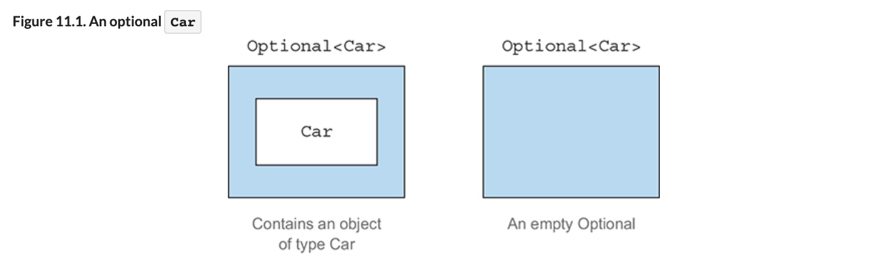
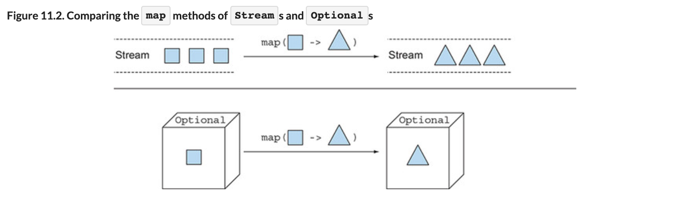
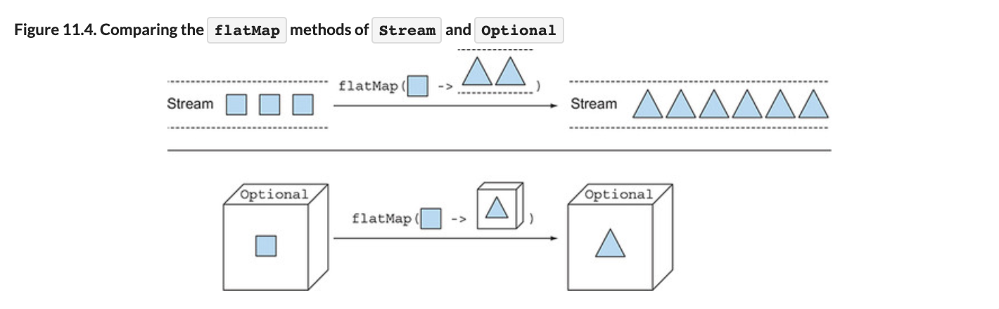
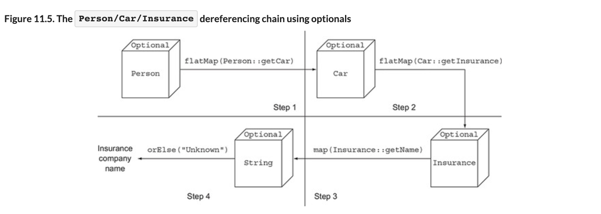
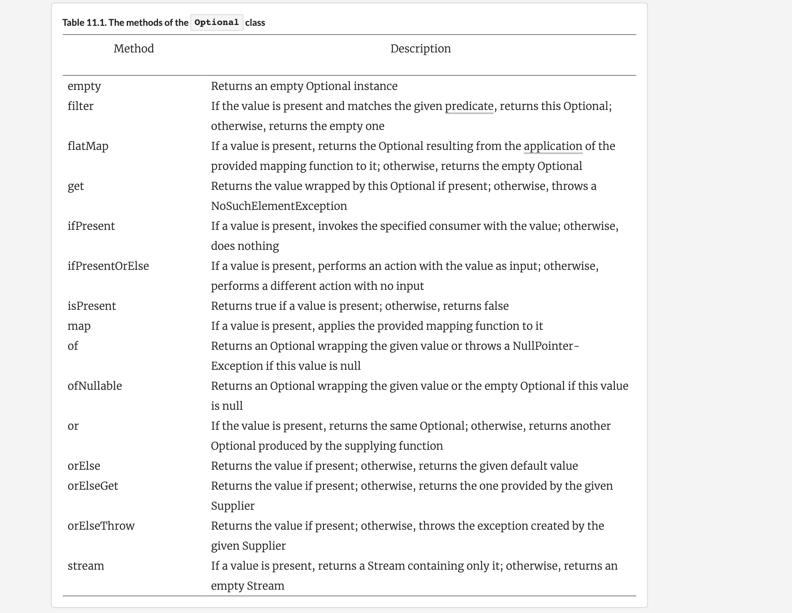

# Chapter11# null대신 Optional 클래스
개발자들은 대부분 NullPointException이 겪어봤을 것이다.  
 

## 1. 값이 없는 상황을 어떻게 처리할까? 
- 아래 코드처럼 자동차,자동자보험을 가진 사람 객체가 구현되어있다.
```java
public class Person {
    private Car car;
    public Car getCar() { return car; }
}
public class Car {
    private Insurance insurance;
    public Insurance getInsurance() { return insurance; }
}
public class Insurance {
    private String name;
    public String getName() { return name; }
}

public String getCarInsuranceName(Person person) {
    return person.getCar().getInsurance().getName();
}
```
- 보험명을 가져오는 getCarInsuranceName에서 어떤 문제가 발생할까? 
- 차를 소유하지 않은 사람이 있는 경우 getCar를 호출하면 null이 반환된다.
- getInsurance는 null을 참조하므로 NullPointException이 발생한다. 
- 마찬가지로 Person이나 getInsurance가 null을 반환하는 경우도 문제가 발생한다.

### `1.1 보수적으로 NullPointException 처리하기`
- NullPointException을 줄이기 위해서는 필요한곳에서 null여부를 확인하는 코드를 추가한다. 
- 아래 방법은 들여쓰기 증가 및 가독성이 떨어진다. 소스도 길어진다. 
- 또, null처리를 잊는 경우 결국 NullPointException이 발생한다. 
```java
// ex1 깊은 의심
public String getCarInsuranceName(Person person) {
    if (person != null) {
        Car car = person.getCar();
        if (car != null) {
            Insurance insurance = car.getInsurance();
            if (insurance != null) {
                  return insurance.getName();
            }
        }
    }
    return "Unknown";
}

// ex1 너무 많은 출구
public String getCarInsuranceName(Person person) {
    if (person == null) {
        return "Unknown";
    }
    Car car = person.getCar();
    if (car == null) {
        return "Unknown";
    }
    Insurance insurance = car.getInsurance();
    if (insurance == null) {
        return "Unknown";
    }
    return insurance.getName();
}
```

### `1.2 null때문에 발생하는 문제`
- 에러의 근원이다.  
    - NullPointException은 자바에서 가장 흔하게 발생하는 에러다.
- 코드를 어지럽힌다.  
    - 중첩된 null확인 구분들이 추가되어야하므로 소스 가독성이 떨어진다.
- 아무 의미가 없다.  
  - null은 아무 의미도 표현하지 않는다. 특히, 정적 형식언어에서 값이없음을 표한하는 방법으로 적절하지 않다.
- 자바 철학에 위배된다.  
  - 자바는 개발자에게 모든 포인터를 숨겼으나 null포인터는 예외된다.
- 형식 시스템에 구멍을 만든다.  
  - null은 무형식으며 정보를 가지고 있지 않다. 따라서 모든 참조형식에 선언할 수 있다.  
  - 이런식으로 null이 할단되고 시스템에 다른 부분으로 퍼지면 null의 의미가 모호해진다. 

### `1.3 다른 언어는 null을 어떻게 표현할까?`

- 그루비 같은 언어에서는 safe navigation operator (?.)를 사용하여 null을 해결했다. 
- 체인 호출중 null이 있으면 결과로 null을 반환한다. 
```Groovy 
def carInsuranceName = person?.car?.insurance?.name
```

- 하스켈은 선택형 값을 저장할수 있는 Maybe라는 형식을 제공한다.
- 스칼라는 Optional[T]구조를 제공한다. 

## 2. Optional 클래스 소개
- 자바8에서는 하스켈과 스칼라의 영향을 받아 Optional<T>라는 클래스를 제공한다.
- Optional은 선택형값을 캡슝화 하는 클래스이다
- 어떤사람이 차를 가지고 있지않다면 Person클래스의 Car는 null값을 가져야한다.


- 값이 있으면 클래스는 값을 감싼다. 
- 값이 없으면 Optional.empty 메서드로 Optinal의 특별한 싱글턴을 반환한다.
- null을 참조하면 NullPointException이 발행하지만 Optional.empty()은 객체이므로 다양한 활용이 가능하다.

- null 대신 Optinal을 사용하면서 Car형식이 Optional<Car>로 바뀌었다.
- 코드는 아래와 같이 변경이 가능하다. 
```java
public class Person {
    private Optional<Car> car; //Optinal로 정의
    public Optional<Car> getCar() { return car; }
}
public class Car {
    private Optional<Insurance> insurance; //Optinal로 정의
    public Optional<Insurance> getInsurance() { return insurance; }
}
public class Insurance {
    private String name; //보험회사는 반드시 이름이 있으므로 Optinal로 정의하지 않음
    public String getName() { return name; }
}
```

- 보험회사명이 null인지 체크하는 코드는 들어가 필요가없다.
- 그런경우는 문제를 찾아 고쳐야한다.
- 따라서 Optional은 값이 없는 상황에 데이더의 문제인지 알고리즘 버그인지 확인이 가능하다. 


## 3. Optional 적용 패턴

### `3.1 Optional 객체 만들기`
**`빈 Optional`**
- 정적 팩토리메서드 Optonal.empty로 빈 Optinal객체를 얻을수 있다. 
```java
Optional<Car> optCar = Optional.empty();
```

**`null이 아닌 값으로 Optional 만들기`**
- 정적 팩토리메서드 Optonal.of로 null이 아닌 값을 포함하는 Optional을 만들 수 있다.  
```java
Optional<Car> optCar = Optional.of(car);
```
- 이제 car가 null이라면 즉시 NullPointException이 발생한다.
- Optinal이 아니라면 car프라퍼티에 접근 할 때 오류가 발생할 것이다. 

**`null 값으로 Optional 만들기`**
- Optional.ofNullable로 null값을 저장할 수 있는 Optinal을 만들수 있다. 
- car가 null이면 빈 Optinal객체가 반환된다.
```java
Optional<Car> optCar = Optional.ofNullable로(car);
```


### `3.1 맵으로 Optional 값을 추출하고 변환하기`
- 보험회사 이름을 추출한다고 할때, insurance가 null인기 확인해야한다. 
```java
String name = null;
if(insurance != null){
    name = insurance.getName();
}
```

- 이러한 경우에 사용할수 있도록 Optional은 map메서드를 제공한다.
```java
Optional<Insurance> optInsurance = Optional.ofNullable(insurance);
Optional<String> name = optInsurance.map(Insurance::getName);

public String getCarInsuranceName(Person person) {
    return person.getCar().getInsurance().getName();
}
```
- 기존에 살펴본 스트림의 map과 비슷할 형태로 Optional객체가 값을 포함하면 map의 인수로 제공된 함수가 값을 바꾼다. 
- 값이 없는 경우 마루일도 일어나지 않는다.  



### `3.1 flatMap으로 Optional객체 연결`
```java
Optional<Person> optPerson = Optional.of(person);
Optional<String> name =
    optPerson.map(Person::getCar)
             .map(Car::getInsurance)
             .map(Insurance::getName);
```
- 위 코드는 컴파일 되지 않는다. 
- optPersondml 형식은 Optional< Person >이므로 map메서드를 호출할수 있다. 
- 하지만 getCar는 Optional< Car >를 반환한다.
- 즉 Optional< Optional< Car > >형식의 객체이다. 

- 이 문제는 faltMap을 사용해서 해결가능하다.
- 이차원 Optional을 일차원 Optional로 평준화 해야한다. 



**`Optional로 보험회사 이름 찾기`**
```java
public String getCarInsuranceName(Optional<Person> person) {
    return person.flatMap(Person::getCar)
                 .flatMap(Car::getInsurance)
                 .map(Insurance::getName)
                 .orElse("Unknown"); // 결과 Optional이 비엇으면 기본값을 사용한다. 
}
```
- Optional을 사용하면 이 메서드를 사용하는 사람들에게 이 메서드가 빈값을 받거나 포함한다는걸 문화해서 제공하는것과 같다.

**`Optional로 Person/Car/Insurance 참조체인`**
- 앞선 코드의 파이프라인 연산을 보여준다. 


- Person을 Optinal로 감싼다음 faltMap(Person::gerCar)를 호출했다. 
- 첫번째 단계에서는 Optional 내부의 Person에 Function을 적용한다.  
 여기서는 Person의 getCar 메서드가 Function이다.   
 gerCar는 Optional< Car >를 반환하므로 중첩된 Optinal이 생성된다. 
- 따라서 faltMap연산으로 Optianal을 평준화한다.  
두 Optinal을 합치면서 둘중 하나라도 null이면 빈 Optinal을 생성한다.  
- faltMap을 빈 Optional에 호출하면 아무일도 일어나지 않는다.   
반면 Optonal이 Person을 감싸고 있으면 faltMapd에 전달될 함수가 Person에 적용된다.

-  **도메인에 Optinal을 사용했을때 직렬화를 할 수 없는 이유**  
    - Optional을 꼭 값이 있는지 없는지 확인했는지 용도로 사용했다.   
    - 하지만 설계자는 이와 다른 용도로 Optional 클래스를 사용할것을 가정했다.   
    - Optional의 용도는 선택형 반환값을 지원하는 것이라고 못박았다.  
    -  Optional 클래스를 필드형식으로 상요할것을 가정하지   않았으므로,   
    - serialization 인터페이스를 구현하지 않는다.   
    - 직렬화가 필요하다면 아래처럼 Optional로 반환되는 메서드를 추가하자
```java
public class Person {
    private Car car;
    public Optional<Car> getCarAsOptional() {
        return Optional.ofNullable(car);
    }
}
```

### `3.4 Optional 스트림 조작`
- 자바 9에서는 Optional을 포함하는 스트림 조작을 편하게 하기 위해서 Optional에 stream()메서드를 추가했다. 

- List< Person > 을 받아 보험회사 명인 Set< String >을 반환하도록 메서드를 구현해보자

- Optinal덕분에 null을 안전하게 처리 가능하지만,  
마지막 결과를 얻기 위해서 빈 ptional을 제거하고 언랩해야 한다. 
```java
Stream<Optional<String>> stream = ...
Set<String> result = stream.filter(Optional::isPresent)
                           .map(Optional::get)
                           .collect(toSet());
```

- Optional의 stream을 이용하면 각 Optinal이 비어있는지 확인하고,  
Optional을 0개 이상 반환한다. 
- 따라서 스트림 요소를 다른 스트림으로 변환하는 연산으로 볼 수 있고 원래대로 flatMap에 전달가능하다.
- 이 방법을 쓰면 한 단계 연산만으로 값을 포함하는 Optianl을 언랩하고 비어있는 Optinal은 건너뛴다.
```java
public Set<String> getCarInsuranceNames(List<Person> persons) {
    return persons.stream()
                  .map(Person::getCar)
                  .map(optCar -> optCar.flatMap(Car::getInsurance)) // Optional<Car> -> Optional<Insurancen>
                  .map(optIns -> optIns.map(Insurance::getName))
                  .flatMap(Optional::stream) //Stream<Optional<String>> -> Stream<String>
                  .collect(toSet());
}
```

- Optinal덕분에 null을 안전하게 처리 가능하지만,  
마지막 결과를 얻기 위해서 빈 ptional을 제거하고 언랩해야 한다. 
```java
Stream<Optional<String>> stream = ...
Set<String> result = stream.filter(Optional::isPresent)
                           .map(Optional::get)
                           .collect(toSet());
```


### `3.5 디폴트액션과 Optional 언랩`
- Optional 인스턴스에 포함된 값을 읽는 다양한 방법들
- `get()`은 가장 간단하면서 안전하지 않은 메서드이다.   
래핑된 값이 있으면 해당 값을 반환하고 값이 없으면 NoSuchElementException이 발생한다.
- `orElse(T other)`를 사용하면 Optinal이 값을 포함하지 않으면 기본값을 제공할 수 있다.
- `orElseGet(Supplier<? extends T> other)`는 orElse에 대응하는 게으른 버전의 메서드이다.  
Optinal에 값이 없을때만 Supplie가 실행된다.   
디폴트 메서드를 만드는데 시간이 걸리거나 Optinal이 비었을때만 기본값을 생선하고 싶다면 `orElseGet(Supplier<? extends T> other)`를 사용해야 한다.  
- `orElseThrow(Supplier<? extends X> exceptionSupplier)`는 Optinal이 비어있을때 예외를 발생시킨다는 점에서 get()ㅘ 비슷하나 발생할 예외종류를 선택할수 있다.
- `ifPresent(Consumer<? super T> consumer)`를 이용하면 값이 존재할때 인수로 넘겨준 동작을 실행한다.  
값이 없으면 아무 일도 일어나지 않는다.
- `ifPresentOrElse(Consumer<? super T> action, Runnable emptyAction)` 자바 9에서 추가되었으며 Optional이 비었을때 실행할수 있는 Runnable을 인수로 받는다. 


### `3.6 두 Optional 합치기`
- person과 car정보를 이용해 가장 저렴한 보험료를 제공하는 보험사를 찾는 외부 서비스 있다고 가정하자. 
```java
public Insurance findCheapestInsurance(Person person, Car car) {
    // 여러 보험사가 제공하는 서비스 조회 
    // 결과 데이터 비교
    return cheapestCompany;
}
```
- 두 Otional을 받아 Optional< Insurance >를 반환하는 nullsafe 메서드를 구현해보자. 
- 인수로 받은값중 하나라도 빈 값이 있으면 빈  Optional< Insurance >을 반환한다. 
- 값이 존재하는지 확인하는 Optional.isPresent메서드를 사용하자. 
```java
public Optional<Insurance> nullSafeFindCheapestInsurance(
                              Optional<Person> person, Optional<Car> car) {
    if (person.isPresent() && car.isPresent()) {
        return Optional.of(findCheapestInsurance(person.get(), car.get()));
    } else {
        return Optional.empty();
    }
}
```

- null을 확인하는 코드과 크게 다를 바가 없다..
- Optional의 stream, flatmap을 이용해 개선해보자
```java
public Optional<Insurance> nullSafeFindCheapestInsurance(
                              Optional<Person> person, Optional<Car> car) {
    return person.flatMap(p -> car.map(c -> findCheapestInsurance(p, c)));
}
```


### `3.7 필터로 값 거르기`
- 객체 매서드를 호출해 프러퍼티를 확인해야 하는 경우가 있다.
- 보험회사의 이름이 "SunnyInsurance"인지 확인해본다고 하자
- 안전하게 확인하려면 null을 체크하고 값을 가져와야한다.
```java
Insurance insurance = ...;
if(insurance != null && "SunnyInsurance".equals(insurance.getName())){
  System.out.println("ok");
}
```
- Optional 객체의 filter를 이용해서 코드를 재 구성해보자
```java
Optional<Insurance> optInsurance = ...;
optInsurance.filter(insurance ->
                        "SunnyInsurance".equals(insurance.getName()))
            .ifPresent(x -> System.out.println("ok"));
```
- filter는 Predicate를 인수로 받는다. 
- Optinal객체가 값을 가지고 Predicate와 일치하면 filter는 그 값을 반환하고 그렇지 않으면 빈 Optinal객체를 반환한다.

- person의 나이가 minAge이상일때반 보험회사명을 반환해보자.
```java
public String getCarInsuranceName(Optional<Person> person, int minAge) {
    return person.filter(p -> p.getAge() >= minAge)
                 .flatMap(Person::getCar)
                 .flatMap(Car::getInsurance)
                 .map(Insurance::getName)
                 .orElse("Unknown");
}
```

- Optional 클래스의 메서드들



## 4. Optional을 이용한 실용 예제

- Optional클래스를 효과적으로 사용하려면 잠재적으로 존재하지 않는 값의 처리 방법을 바꿔야 한다.
- 즉 구현 코드만 바꾸는게 아닌 네이티브 자바 API와 상호작용하는 방식도 바꿔야한다. 


### `4.1 잠재적으로 null이 될 수 있는 대상을 Optinal로 감싸기`
- 기존 자바 API들은 null을 반환하면서 요청값이 없거나 계산에 실패했음을 표현한다.
- 예를 들어 Map의 get메서드는 값을 찾지 못햇을때 null을 반환한다.
- if-then-else구문 또는 Optinal의 Nullable로 감싸서 해결이 가능하다. 
```java
//기본 Map
Object value = map.get("key");
//반환값을 Optianal로 감싼다. 
Optional<Object> value = Optional.ofNullable(map.get("key"));
```java


### `4.2 예외와 Optional 클래스`
- 자바 API에서 값을 제공할수 없을때 null이 아닌 Exception을 발생시키는 경우가 있다.
- 대표적으로 Integer.parseInt(String)은 NumberFormatException을 발생시긴다. 
- 이런 경우는 if문이 아닌 try-catch문을 사용해야 한다.
- parseInt자체를 고칠순 없지만 parseInt를 Optional로 감싸는 유틸함수를 하나 만들어 해결이 가능하다.  
```java
public static Optional<Integer> stringToInt(String s) {
    try {
        return Optional.of(Integer.parseInt(s));
    } catch (NumberFormatException e) {
        return Optional.empty();
    }
}
```

### `4.3 기본형 Optional을 사용하지 말아야 하는 이유`
- Optional도 스트림처럼 기본형으로 특화된 OptionalInt, OptionalLong등의 클래스를 제공한다.
- 예를 들어 위 예제에서 Optional<Integer>대신 OptionalInt를 사용가능하다.
- 스트림과 달리 Optional의 최대 요소는 하나이므로 성능 개선은 불가하다.
- 기본혁 특화 Optional은 flatMap, map, filter들을 제공하지않으므로 사용이 권장되지 않는다. 
- 또한 일반 Optional과 혼용이 될수 없다.


### `4.4 응용`
- 프로그램 설정 인수로 Properties를 전달한다고 가정하자
```java
Properties props = new Properties();
props.setProperty("a", "5");
props.setProperty("b", "true");
props.setProperty("c", "-3");
```

- 프로그램에서 Properties를 초단위 지속시간으로 해석한다.
```java
public int readDuration(Properties props, String name)
```
- 시간은 양수이므로 이외의 값이 들어오면 0을 반환하도록 한다.
- 예상 결과값은 아래와 같다.

```java
assertEquals(5, readDuration(param, "a"));
assertEquals(0, readDuration(param, "b"));
assertEquals(0, readDuration(param, "c"));
assertEquals(0, readDuration(param, "d"));
```
- 이제 readDuration를 구현해보자
- try-catch가 많아 지저분하다. 
```java
public int readDuration(Properties props, String name) {
    String value = props.getProperty(name);
    if (value != null) {
        try {
            int i = Integer.parseInt(value);
            if (i > 0) {
                return i;
            }
        } catch (NumberFormatException nfe) { }
    }
    return 0;
}
```

- Optional을 이용해 소스 변경 

```java
public int readDuration(Properties props, String name) {
    return Optional.ofNullable(props.getProperty(name))
                   .flatMap(OptionalUtility::stringToInt)
                   .filter(i -> i > 0)
                   .orElse(0);
}
```

## 5. 마치며
- 역사적으로 프로그래밍 언어는 null참조로 값이 없음을 표현해왔다.
- 자바 8에서는 값이 있거나 없음을 표현하는 클래스 java.util.Optional<T>을 제공한다. 
- 팩토리 메서드 Optional.empty, Optional.of, Optional.ofNullable을 이용해 Optional객체를 만들 수 있다. 
- Optional 클래스는 스트림과 비슷한 연산을 하는 map, faltmap, filter등의 기능을 제공한다.
- Optional로 값이 없는 상황을 적절하게 처리하도록 강제할 수 있다. 즉, Optional로 예상치 못한 null을 예외를 방지할 수 있다.
- Optional을 활용하면 더 좋은 API를 설계할수 있다. 즉, 사용자는 메서드 시그니처만 보고도 Optional이 사용되거나 반환되는지 예측 가능하다. 
