# Chapter16# CompletableFuture: 안정적 비동기 프로그래밍 

## 1. Future의 단순활용 
- 자바 5에서는 미래의 시점에 결과를 얻는 모델에 활용 할 수 있도록 Future인터페이스를 제공한다.
- 비동기 계산을 모델링하는데 Future를 이용할 수 있으며 계산이 끝났을때 접근할수 있도록 참조를 제공한다.
- 시간이 걸릴수 있는 작업을 Future내부로 설정하면 호출자가 스레드결과를 기다리는동안 다른 작업을 수행할 수 있다.
- Future를 이용하려면 오래걸리는 작업을 Callable객체로 감싼 다음 ExcutorService에 제출해야한다. 

```java
ExecutorService executor = Executors.newCachedThreadPool();
Future<Double> future = executor.submit(new Callable<Double>() {
        public Double call() {
            return doSomeLongComputation(); //시간이 오래걸리는 작업 수행
        }});
doSomethingElse(); //다른작업을 수행
try {
    Double result = future.get(1, TimeUnit.SECONDS);
    // 비동기 작업 결과를 가져온다. 결과가 없으면 block, 최대 1초까지만 기다린다. 
} catch (ExecutionException ee) {
    // 계산중 예외발생
} catch (InterruptedException ie) {
    // 현재스레드에서 대기중 인터럽트 발생
} catch (TimeoutException te) {
    // Future 완료 전 타임아웃 발생
}
```

- ExcutorService에서 제공하는 스레드가 오래걸리는 작업을 처리하는 동안 우리의 스레드로 다른작업을 동시에 처리가 가능하다. 
- get메서드를 호출했을때 계산이 완료된 상태면 결과를 즉시 반환하고, 아닌 경우 완료될때까지 우리 스레드를 block시킨다.
- 오래걸리는 작업이 끝나지않으면 계속 block되므로 get을 오버로드해서 적당한 타임아웃을 설정해주는것이 좋다. 
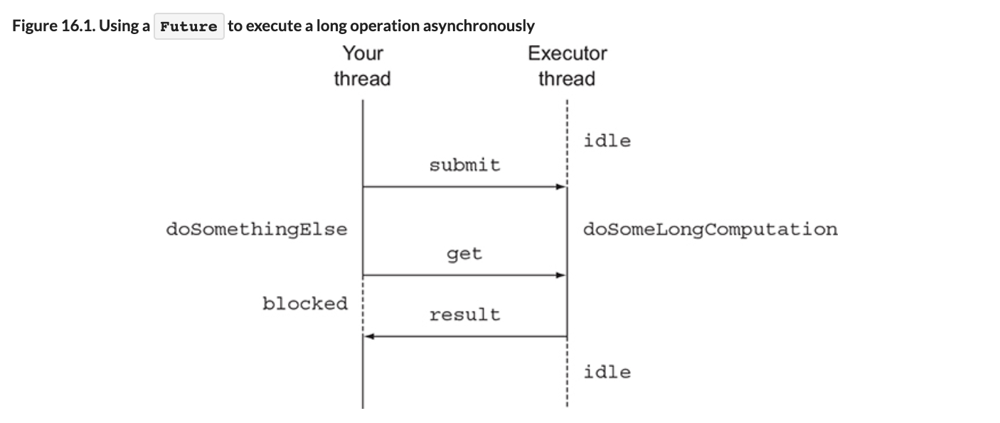


### `1.1 Future 제한`
- 계산이 끝났는지 확인하는 isDone메서드, 계산이 끝나길 기다리는 메서드, 결과회수 메서드등을 간단한 예제로 알아보자.
- 단, 위 함수들로는 여러 Future의 의존성을 표현하기는 어렵다. 
- 예를 들어 "오래걸리는 A라는 계산이 끝나면 B로 전달한뒤, B의 결과가 나오면 다른 결과랑 조합하라"같은 요구사항들은 쉽게 구현할 수 없다.
- 다음과같은 선언형 기능이 있다면 매우 유용하게 사용가능하다.
  -  두개의 비동기 계산결과를 하나로 합친다. 두 결과는 서로 독립적이거나 두번째 결과라 첫번째 결과에 의존하는 상황일 수 있다.
  - Future집합이 실행하는 모든 태스크의 완료를 기다린다.
  - Future에거 가장 빨리 완료되는 태스크를 기다린뒤 결과를 얻는다.
  - 프로그램적으로 Future를 종료한다(비동기 동작에 수동으로 결과 전달.)
  - Future완료 동작에 반응한다.(결과를 기다리지않고, 완료알람을 받은뒤 추가동작을 수행)
- 이제 위같은 선언형으로 이용할 수 있는 CompletableFuture(자바8에서 제공)클래스를 살펴본다. 
- CompletableFuture는 스트림처럼 람다와 파이프라이닝을 활용한다.


### `1.2 FutuCompletableFuture로 비동기 어플리케이션 만들기`
- 온라인에서 가장 저렵한 가격을 제공하는 상점을 찾는 어플리케이션을 만드는 예제를 통해 아래 내용을 배워보자.
  - 1. 고객에게 비동기 API를 제공하는 법을 배운다.
  - 2. 동기 API를 사용해야할 때 코드를 비블록으로 만드는 법을 배운다.  
  두개의 비동기종작을 파이프라인으로 방법과 두개의 동작결과를 하나의 비동기 계산으로 합치는 방법을 알아본다.  
  (예) 상점에서 할인코드 반환시 다른 원격할일 서비스에 접속해 해당코드의 할인율을 얻는다. 그리고 최종결과를 반환한다. 
  - 3. 비동기 동작의 완료에 대응하는 법을 배운다.  
  즉, 모든 상점에서 결과얻기를 기다리지않고 얻을때마다 즉시 최저가를 갱신하도록 한다.

> [동기 API와 비동기 API]


## 2. 비동기 API 구현
- 최저가격 검색 어플리케이션 구현을 위해 각 상점에서 제공하는 API를 정의한다. 
  다음은 제품명에 해당하는 가격을 반환하는 메서드이다.
```java
public class Shop {
    public double getPrice(String product) {
        // to be implemented
    }
}
```
- getPrice는 상점의 DB를 이용해 가격정보를 얻는 동시에 판매자 정보나 프로모션 정보등 다른 서비스에 접근한다. 
- 우리는 실제로 구현하지 않고 인위적으로 1초를 지연시키는 delay라는 메서드로 대체한다. 

```java
public static void delay() {
    try {
        Thread.sleep(1000L);
    } catch (InterruptedException e) {
        throw new RuntimeException(e);
    }
}
```

- 이제 지연후에 임의의 계산값(할인가격등)을 반환하도록 getPrice를 구현한다. 
```java
public double getPrice(String product) {
    return calculatePrice(product);
}

private double calculatePrice(String product) {
    delay();
    return random.nextDouble() * product.charAt(0) + product.charAt(1);
}
```
- 사용자가 이 API를 호출하면 비동기 동작이 완료될때까지 1초간 블록된다.
- 위 메서드로 모든 온라인 상점의 가격을 검색해야하므로 블록동작은 적절치 않으므로 비동기 API로 만들어보자. 
- 물론 동기 API를 비동기적으로 소비할수도 있으며 나중에 설명한다.


### `2.1 동기 메서드를 비동기 메서드로 전환`
- 우선 이름과 반환값을 변경하자
```java
public Future<Double> getPriceAsync(String product) { ... }
```
- Future는 비동기 핸들일 뿐이고 실제 값은 get메서드로 얻는다.
- getPriceAsync는 호출즉시 반환되므로 호출자 스레드는 다른 작업을 수행할 수 있다. 
```java
public Future<Double> getPriceAsync(String product) {
    CompletableFuture<Double> futurePrice = new CompletableFuture<>();
    new Thread( () -> {
                double price = calculatePrice(product); //다른스레드에서 비동기로 계산수행
                futurePrice.complete(price); // 계산이 완료되면 Future에 값 설정
    }).start();
    return futurePrice; //계산완료를 기다리지않고 Future 반환
}
```

- 비동기 계산과 결과를 포함하는 CompletableFuture 인스턴스를 만든다.
- 실제가격을 계산할 스레드를 만든뒤 결과를 기다리지않고 Future인스턴스를 반환한다.
- 가격정보가 도착하면 complete를 이용해 CompletableFuture를 종료한다.
- 아래처럼 클라이언트 코드를 구현해 getPriceAsync를 사용한다.

```java
Shop shop = new Shop("SunnyShop");
long start = System.nanoTime();
Future<Double> futurePrice = shop.getPriceAsync("my favorite product"); //가격정보 요청
long invocationTime = ((System.nanoTime() - start) / 1_000_000);
System.out.println("Invocation returned after " + invocationTime + " msecs");

// 가격 검색하는 동안
doSomethingElse();
// 다른 작업 수행

try {
    double price = futurePrice.get(); // 가격정보가 있으면 얻고 없으면 얻을때까지 block
    System.out.printf("Price is %.2f%n", price);
} catch (Exception e) {
    throw new RuntimeException(e);
}
long retrievalTime = ((System.nanoTime() - start) / 1_000_000);
System.out.println("Price returned after " + retrievalTime + " msecs");
```
- 클라이언트는 특정 제품의 가격을 상점에 요청한다.
- 상점은 비동기 aPI를 제공하므로 즉시 Future를 반환한다.
- 클라이언트는 Future를 통해 나중에 결과를 얻을수 있고, 그 사이 다른 삼정게 가격정보를 요청할 수 있다. 
- 나중에 클라이언트가 할일이 업을때 Future의 get을 호출해서 결과를 얻거나 얻을때까지 블록한다. 
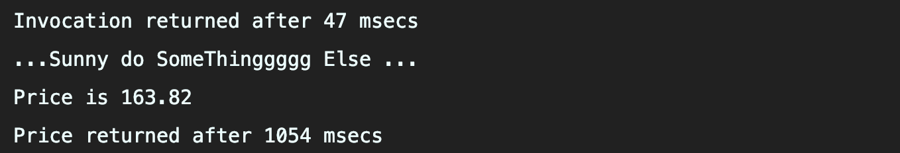
- 위 결과처럼 가격 계산이 끝나기 전에 getPriceAsync가 반환된다. 
- 4번항목에서 클라이언트가 블록을 완전히 회피하는 방법을 다룬다.
- 즉, 블록하지 않고 Future 작업이 끝낫을때 통지를 받고 람다나 메서드참조로 정의된 콜백을 실행하도록 한다. 

### `2.2 에러처리 방법`
- 가격을 계산하는 동안 에러가 발생하면 어떻게될까?
- 에러는 에러가 발생각 스레드에만 영향을 미친다.
- 따라서 에러가 발생해도 가격계산은 계속 진행되면서 일의 순서가 꼬이게되고 클라이언트는 get이 반환될때까지 계속 기다려야 할 수있다.
- 클라이언트는 타임아웃값을 받는 get메서드 오버로드로 이런 상황을 피할수 있다.
- 블록 문제가 발생할수 있는 상황에서는 활용하여 타임아웃 기시간이 지난뒤 `TimeoutException`을 받아 처리할수 있다. 
- 하지만, 이때 제품 가격예산에서 왜 에러가 발생했는지 알수없으므로 completeExceptionally 메서드를 이용해서 CompletableFuture내부의 예외를 클라이언트에 전달해야한다. 
```java
public Future<Double> getPriceAsync(String product) {
    CompletableFuture<Double> futurePrice = new CompletableFuture<>();
    new Thread( () -> {
                try {
                    double price = calculatePrice(product);
                    futurePrice.complete(price);
                } catch (Exception ex) {
                    futurePrice.completeExceptionally(ex);
                    // 문제 발생시 발생한 에러를 포함하여 Future를 종료한다. 
                }
    }).start();
    return futurePrice;
}
```
- 이제 클라이언트에서는 예외 파람을 토함하는 ExcutionException을 받게된다. 예를들어 'prodcut not avaliable' 라는 RuntimeExcption발생시 아래처럼 오류를 받는다.
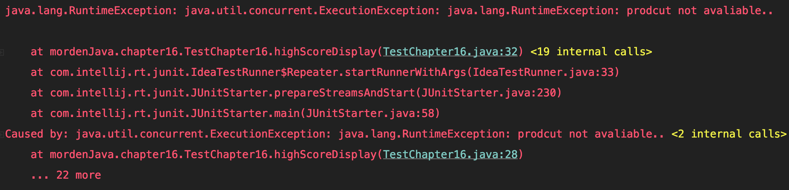

#### **`팩토리 메서드 supplyAsync로 CompletableFuture 만들기`**
- 지금까지는 직접 CompletableFuture를 만들었지만 좀 더 간단하게 만들 수 있다. 
```java
public Future<Double> getPriceAsync(String product) {
    return CompletableFuture.supplyAsync(() -> calculatePrice(product));
}
```
- supplyAsync는 Supplier를 인수로 받아서 CompletableFuture를 반환한다.  
CompletableFuture는 Supplier를 실행해 비동기적으로 결과를 생성한다.  
ForkJoinPool의 Excutor중 하나가 Supplier를 실행할것이다.

- 두번째 인자를 받는 오버로드 버젼의 supplyAsync 함수를 이용해 Excutor를 지정 가능하다. (3.4에서 알아보자)  
getPriceAsync가 반환하는 CompletableFuture는 앞서 만든 CompletableFuture와 같이 에러를 반환한다. 

- 이제 Shop에서 구현한 API는 우리가 제어할수 없으므로 동기방식의 블록메서드라 가정한다.   
블록 메서드를 사용하는 상황에서 동기적으로 여러상점에 질의하는 법을 알아보자


## 3. 비블록 코드 만들기 
- 아래와 같은 상점 리스트가 있다고 하자. 
```java
List<Shop> shops = List.of(new Shop("SunnyShop"),
                           new Shop("CindyShop"),
                           new Shop("TedShop"),
                           new Shop("JavaShopShop"));
```
- 제품명을 입력하면 상점명과 제품명 문자열 List를 반환하는 메서드를 구현해야 한다. 
```java
public List<String> findPrices(String product) {
    return shops.stream()
       .map(shop -> String.format("%s price is %.2f",
                                  shop.getName(), shop.getPrice(product)))
       .collect(toList());
}
```

- 이제 물건을 가격을 찾고 소요된 시간을 측정해보자
- 각각 1초의 대기시간이 있으므로 4초 이상이 걸린다. 


### `3.1 병렬 스트림으로 요청 병렬화하기`
- 7장에서 살펴본것처럼 병렬 스트림을 이용해서 성능을 개선할 수 있다.
```java
public List<String> findPrices(String product) {
    return shops.parallelStream()
       .map(shop -> String.format("%s price is %.2f",
                                  shop.getName(), shop.getPrice(product)))
       .collect(toList());
}
```

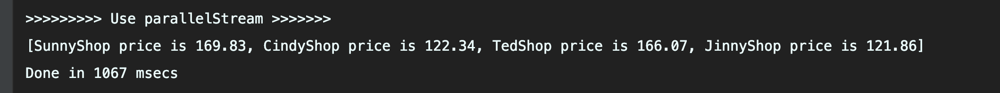

- CompletableFuture를 이용해서 성능을 더 개선해보자!

### `3.2 CompletableFutrue로 비동기 호출 구현하기`
- 팩토리 메서드 supplyAsync로 CompletableFutrue를 만들수 있음을 활용해보자. 
```java
List<CompletableFuture<String>> priceFutures =
        shops.stream()
        .map(shop -> CompletableFuture.supplyAsync(
             () -> String.format("%s price is %.2f",
             shop.getName(), shop.getPrice(product))))
        .collect(toList());

```
- 위 코드로 CompletableFutrue를 포함하는 `List<CompletableFutrue<String>>`를 얻을 수 있다.
- 리스트의 CompletableFutrue는 각각 계산결과가 끝난 상점 이름 문자열을 포함한다. 
- 우리가 구현하는 findPrices메서드 반환형식은 `List<String>`이므로 모든 CompletableFutrue 동작이 완료되고 결과를 추출한뒤 리스트를 반환해야한다.

- 두번째 map연산을 `List<CompletableFutrue<String>>`에 적용할 수 있다.  
즉, 모든 CompletableFutrue에서 join을 호출해 동작이 끝나길 기다린다.
- CompletableFutrue클래스의 join메서드는 Future인터페이스의 get과 같은 의미를 가진다.
- 다만 join은 아무 예외도 발생시키시 않으므로 두번째 map의 람다를 try-catch로 묶지 않아도 된다. 
 ```java
public List<String> findPrices(String product) {
    List<CompletableFuture<String>> priceFutures =
            shops.stream()
            .map(shop -> CompletableFuture.supplyAsync( //CompletableFuture로 각 가격을 비동기적으로 계산
                         () -> shop.getName() + " price is " +
                               shop.getPrice(product)))
            .collect(Collectors.toList());
    return priceFutures.stream()
            .map(CompletableFuture::join) //모든 비동기 동작이 끝나기를 기다린다.
            .collect(toList());
}
```
- 두 map연상을 하나의 스트림처리 파이프라이이 아닌 두개의 파이프 라인으로 처리했다. 
- 스트림은 게으름 연산이르모 하나의 파이프라인으로 처리한 경우 모든 가격정보 요청 동작이 동기적,순차적으로 이뤄진다.
- CompletableFuture로 각 상점 정보를 요청할때 기존 요청이 완료되어야 join을 반환하면서 다음 상점으로 요청할수 있기 때문이다. 
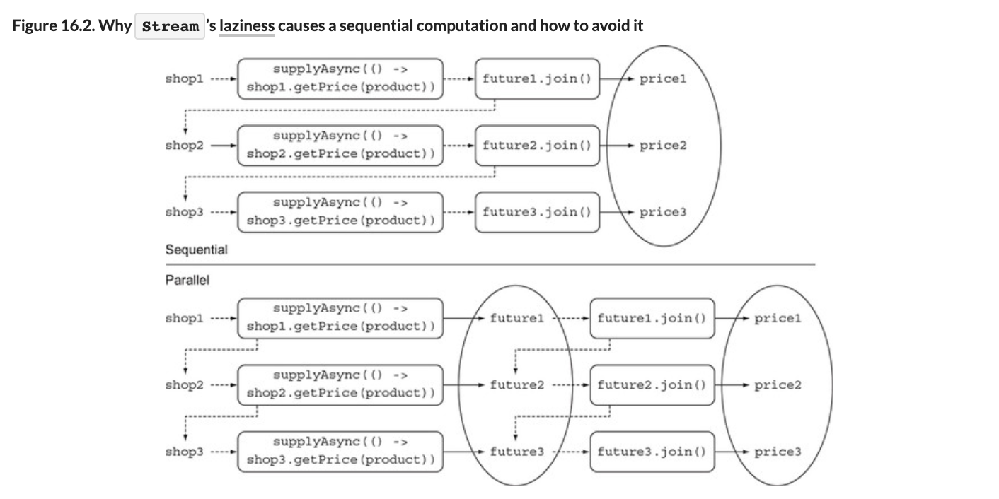

- 그림에서 위는 단일 파이프라인을 보여준다.
- 아래 그림은 CompletableFuture를 리스트로 모은뒤 다른 작업과 독립적으로 수행하는것을 보여준다.


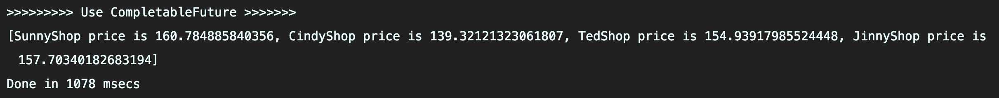
```
[BestPrice price is 123.26, LetsSaveBig price is 169.47, MyFavoriteShop price is 214.13, BuyItAll price is 184.74]
Done in 2005 msecs
```
- 책에선 위와같은 결과가 나온다.
- 시간이 더 늘어났다....?
- 수행하는 기기는 44ㅐ의 스레드를 병렬로 처리할수있음에 주목해서 더 고민해보자


### `3.3 더 확장성이 좋은 해결법`
- 병렬스트림버전의 코드는 4개의 상점에 하나씩 스레드를 할당해 수행하며 성능을 개선했다.

- 5번째 상점이 추가된다면 결국 시간이 1초 늘어서 총 5초가 소요된다. 
```
[BestPrice price is 123.26, LetsSaveBig price is 169.47, MyFavoriteShop price is 214.13, BuyItAll price is 184.74, ShopEasy price is 166.08]
Done in 5025 msecs
```

- 병렬 스트림 버전에서는 4개 스레드가 모두 사용되었으므로 5번째 상점을 처리하는데 1초 이상 소요된다.
- 즉 네개의 스레드중 하나가 작업을 완료해야 다섯번째 질의를 수행가능하다.
```
[BestPrice price is 123.26, LetsSaveBig price is 169.47, MyFavoriteShop price is 214.13, BuyItAll price is 184.74]
Done in 2217 msecs
```
- CompletableFuture 버전에서는 ??
```
[BestPrice price is 123.26, LetsSaveBig price is 169.47, MyFavoriteShop price is 214.13, BuyItAll price is 184.74]
Done in 22200617 msecs
```
- 시간이 약간 줄었지만 뭐 비슷하다. 
- 9개가 있다고 할때 병렬 스트림은 3143, CompletableFuture는 3009가 소요된다.
- 두 버전 모두  `Runtime.getRuntime().available-Processors()`가 반환하는 스레드 수를 사용하면 비슷한 결과가 나온다
- 하지만, CompletableFuture는 Excutor를 지정할수 있으므로 Excutor로 스레드풀을 조정하는등 설정을 통해 성능을 향상 시킬 수 있다.

### `3.4 커스텀 Excutor사용하기`
- 어플리케이션이 실제로 필요한 작업량을 고려한 풀에서 관리하는 스레스 수에 맞게 Excutor를 만들수 있으면 좋을것이다.
- 풀에서 관리하는 스레드 수를 어떻게 결정할 수 있을까?

> [스레트 풀 크기 조절]  
> '자바 병렬 프로그래밍( Java Concurrency in Practice)'에서 스레드 풀의 최적화 값을 찾는 방법을 제공한다.  
> 스레드 풀이 너무 크면 cpu와 메모리 자원을 서로 경쟁하므로 시간을 낭비할 수 있다.  
> 스레드 풀이 너무 작으면 cpu일부 코어가 활용되지 않는다.   

> [스레드풀 계산 공식]  
  `N threads = N CPU * U CPU * (1 + W/C)`  
> N CPU : Runtime.getRuntime().availavleProcess()가 반환하는 코어수   
> U CPU : 0과 1사이의 cpu활용 비율  
> W/C : 대기시간과 계산시간 비율  

- 우리 어플리케이션은 상점의 응답을 대략 99퍼센트시간동안 기다리므로 W/C 비율을 100으로 간주한다.
- 즉, 대상 cpu 활용률이 100퍼센트라면 400스레드를 갖는 풀을 만들어야 한다.
- 하지만 상점수보다 많은 스레드를 갖는것은 낭비이므로 한상점에 하나의 스레드를 갖도록 Excutor를 정하다.
- 스레트수가 너무 많으면 서버가 크래시 될 수 있으니 하나의  Excutor의 스레드는 100 이하로 설정하는게 좋다.
```java
private final Executor executor =
        Executors.newFixedThreadPool(Math.min(shops.size(), 100),
                                     (Runnable r) -> {
                Thread t = new Thread(r);
                t.setDaemon(true); //프로그램종료를 방해하지않는 데몬스레드 사용
                return t;
            }
);
```
- 우리가 만드는 풀은 데몬스레드를 포함한다.  
자바에서 일반스레드가 실행중이면 자바프로그램은 종료되지 않으므로  어떤 이벤트를 하염없이 기다리면서 종료되지 않는 일반 스레드가 잇는경우 문제될수 있다.  
데몬스레드는 자바스레드가 종료될때 강제로 종료될수 있다.  
두 스레드 성능은 같다. 

- 이제 새로운 Executor를 supplyAsync의 두번째 인수로 전달하자.
```java
CompletableFuture.supplyAsync(() -> shop.getName() + " price is " + shop.getPrice(product), executor);
```

- 성능 결과는 5개상점 -> 1021ms, 9개상점 -> 1022ms 가 소요된다.
- 앞서 계산한것처럼 400개 상점까지 위 성능을 유지할 수 있다. 

> [스트림의 병렬화와 CompletableFuture 병렬화]  
> 둘중 어떤 병렬화 기법을 사용할지 선택하는데 도움을 주는 내용들
> - I/O가 포함되지 않은 계산중심인 경우 stream 인터페이스가 간당하며 효율적이다.
> - 작업이 I/O를 기다리는 작업을 병렬로 실행할때는 CompletableFuture가 더 유연성을 제공하며, W/C 비율에 적합한 스레드 수를 설정할 수 있다.  
스트림의 게으른 특성때문에 I/O를 실제로 언제할지 예측하기 어려운 문제도 있다.

## 4. 비동기 작업 파이프 라인 만들기 
- 각각의 상점들이 할인서비스를 사용한다고 가정하자.
- 할인서비스에서는 서로 다른 할인율을 제공하는 5개 코드를 제공한다.
```java
public class Discount {
    public enum Code {
        NONE(0), SILVER(5), GOLD(10), PLATINUM(15), DIAMOND(20);
        private final int percentage;
        Code(int percentage) {
            this.percentage = percentage;
        }
    }
}
```
- getPrice 함수도 '상점명:가격:할인코드'를 반환하도록 바꾼다. 
- 가격과 할인코드는 임의로 계산한다. 
- `SunnyShop:123.26:GOLD` 이런식으로 반환된다. 
```java
public String getPrice(String product) {
    double price = calculatePrice(product);
    Discount.Code code = Discount.Code.values()[
                            random.nextInt(Discount.Code.values().length)];
    return String.format("%s:%.2f:%s", name, price, code);
}
private double calculatePrice(String product) {
    delay();
    return random.nextDouble() * product.charAt(0) + product.charAt(1);
}
```

### `4.1 할인 서비스 구현`
- 이제 우리는 가격정보를 얻어서 파싱하고 할인서버에 질의를 보낼 준비가 되었다.
- 할인서버에서 할인율을 확인해 최종 가격을 계산해야 한다.
- 할인코드-할인율을 변경가능하므로 매번 서버에서 받아야한다. 
- 상점에서 제공한 문자열을 아래처럼 Quote클래스로 파싱해서 캡슐화 한다.
```java 
public class Quote {
    private final String shopName;
    private final double price;
    private final Discount.Code discountCode;
    public Quote(String shopName, double price, Discount.Code code) {
        this.shopName = shopName;
        this.price = price;
        this.discountCode = code;
    }
    public static Quote parse(String s) {
        String[] split = s.split(":");
        String shopName = split[0];
        double price = Double.parseDouble(split[1]);
        Discount.Code discountCode = Discount.Code.valueOf(split[2]);
        return new Quote(shopName, price, discountCode);
    }
    public String getShopName() { return shopName; }
    public double getPrice() { return price; }
    public Discount.Code getDiscountCode() { return discountCode; }
}
```

- Discount 서비스에서는 파싱 Quote객체를 받아 할인된 가격을 반환하도록 applyDiscount 함수를 제공한다. 
- Discount는 원격서비스니까 1초의 지연을 추가하자 
```java 
public class Discount {
    public enum Code {
        // source omitted ...
    }
    public static String applyDiscount(Quote quote) {
        return quote.getShopName() + " price is " +  Discount.apply(quote.getPrice(), quote.getDiscountCode());
    }
    private static double apply(double price, Code code) {
        delay();
        return format(price * (100 - code.percentage) / 100);
    }
}
```

### `4.2 할인 서비스 사용`
- 일단 가장 간단하게 순차/동기 방식으로 findPrices를 구현해보자. 
```java 
public List<String> findPrices(String product) {
    return shops.stream()
            .map(shop -> shop.getPrice(product))
            .map(Quote::parse)
            .map(Discount::applyDiscount)
            .collect(toList());
}
```
- 세개의 map 연산을 상점 스트림에 파이프라인으로 연결해서 결과를 얻었다. 
  - 첫번째 연산에서 요청함 제품의 각 상점별 가격/할인모드로 변환한다.
  - 주번째 연산에서 이 문자열을 파싱해서 Quote 객체를 만든다.
  - 세번째 연산에서는 원격 Discount 서비스에 접근해 최종 할인 가격을 계산하고 결과 문자열을 반환한다.
- 이미 알겠지만 성능은 매우....

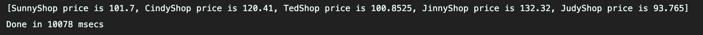

- 병렬스트림을 사용할수도 있지만,, 스레드풀이 고정적이므로
- 우리는 커스텀 Excutor와 CompletableFuture를 통해 cpu 활용을 극대화 하자


### `4.3 동기작업과 비동기 작업 조합하기` 
- CompletableFuture가 제공하는 기능으로 findPrices를 비동기적으로 재구현 하자
```java
public List<String> findPrices(String product) {
    List<CompletableFuture<String>> priceFutures =
        shops.stream()
             .map(shop -> CompletableFuture.supplyAsync(
                                   () -> shop.getPrice(product), executor)) //가격정보 얻기
             .map(future -> future.thenApply(Quote::parse)) //Quote 파싱 
             .map(future -> future.thenCompose(quote ->
                         CompletableFuture.supplyAsync(
                           () -> Discount.applyDiscount(quote), executor)))
                .collect(toList());
    return priceFutures.stream()
            .map(CompletableFuture::join)
            .collect(toList());
}
```

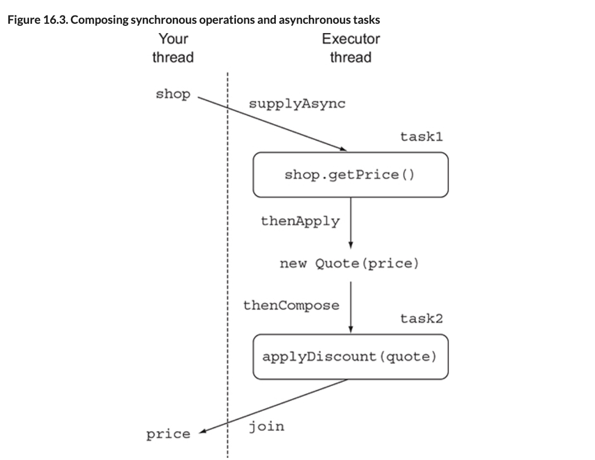

#### **`가격정보 얻기`**
```java
.map(shop -> CompletableFuture.supplyAsync(
                                   () -> shop.getPri(product), executor))
 ```                                  
- 첫번째 연산은 팩토리메서드 supplyAsync에 람다를 전달해서 비동기적으로 상점에서 정보를 조회했다.
- 첫번째 변환의 결과는 `Stream<CompletableFuture<String>>` 이다.
- 앞서 개발한 Excutor로 CompletableFuture를 설정한다.

#### **`Quote 파싱하기`**
```java
.map(future -> future.thenApply(Quote::parse))
 ```   
 - 첫번째 결과 문자열을 Quote로 변환한다. 
 - 파싱동작은 원격호출이나 I/O가 없으므로 즉시 동작을 수행할 수 있다. 
 - 첫번째과정에서 생성된 CompletableFuture에 thenApply를 호출한 다음 문자열을 Quote로 변환하는 Function에 전달한다. 
 - thenApply는 CompletableFuture가 끝날때까지 블록하지 않는다.
 - 즉, CompletableFuture가 동작을 완전히 완료한 다음 thenApply 메서드로 전달된 람다표현식을 적용할 수 있다.
 - 이 연산에서 `CompletableFuture<String>`을 `CompletableFuture<Quote>` 변환할것이다.

#### **`CompletableFuture 조합해서 할인된 가격 계산하기`**
- 세번째 map 연산에서는 상점에서 받은 할인전 가격에 Discount 서비스의 할인을 적용해야한다.
- 이번엔 원격호출이 있으므로 이번 변환과 달리 동기적으로 수행해야한다.
- 람다 표현식으로 이 동작을 팩토리 메서드 supplyAsync에 전달 할 수 있다.
- 그러면 다른 CompletableFuture가 반환된다. 결국 두개의 CompletableFuture로 이루어진 연쇄적인 두개의 비동기 동작을 얻을 수 있다.
   - 상점에서 가격정보를 얻어와 Quote로 변환하기
   - 변환된 Quote를 Discount서비스로 전달해 최종가격 얻기

```java
.map(future -> future.thenCompose(quote ->
                         CompletableFuture.supplyAsync(
                           () -> Discount.applyDiscount(quote), executor)))
 ```   
- 자바 8의 CompletableFuture API는 두개의 비동기 연산을 파이프라인으로 만들도록 thenCompose 연산을 제공한다.
- thenCompose는 첫번째 연산의 결과를 두번째 연산으로 전달한다.
- 첫번째 CompletableFuture에 thenCompose를 호출하고 Function에 넘겨주는 식으로 두 CompletableFuture를 조합할 수 있다. 
- Function은 첫번째 CompletableFuture반환 결과를 인수로 받고 두번째 CompletableFuture의 결과를 계산의 입력으로 사용한다.
- 따라서 Future가 여러 상점의 결과를 가져오는 동안 메인스레드는 UI등에 업무를 수행 할 수 있다.
- 세 map연산을 수행하면 `Stream<CompletableFuture<String>>` 형태가 반환되므로 마지막 CompletableFuture반환을 기다린뒤 join으로 값을 추출할 수 있다. 
```java
[BestPrice price is 110.93, LetsSaveBig price is 135.58, MyFavoriteShop price
     is 192.72, BuyItAll price is 184.74, ShopEasy price is 167.28]
Done in 2035 msecs
```
- thenCompose Async버전이 존재한다.
- Async로 끝나지 않는 메서드는 이전작업을 수행한 스테르와 같은 스레드에서 작업을 진행한다.  
- Async로 끝나는 메서드는 다음작업이 다른 스레드에서 실행되도록 스테드풀로 작업을 제출한다. 
- 여기서는 첫번째 결과가 두번째 결과에 의존하므로 굳이 Async를 쓸필요는 없다.


### `4.4 독립 CompletableFuture와 비독립 CompletableFuture 합치기`
- 앞서서는 첫번째 결과를 두번째 입력으로 받아 전달했다.
- 실제로는 독립적으로 실행된 두개의 CompletableFuture결과를 합쳐야 하는 경우들이 있다. 
- 이런 상황에서는 thenConbine메서드를 활용한다.
- thenConbine메서드는 BiFuntion을 두번째 인자로 받는다. 
- BiFuntion은 두개의 CompletableFuture 결과를 어떻게 합칠지 정의한다.
- thenConbine메서드도 Async버전이 존재하며 BiFuntion이 정의하는 조합 동작이 스레드풀로 전달되면 별도의 테스크에서 비동기적으로 수행된다. 

- 예제는 온라인 상점에서 유로로 가격을 제공하는 걸 가정하자
- 우리는 원격의 환율 서비스에 접근해서 달러로 변환하는 작업을 한뒤 가격에 환율을 곱해서 결과를 보여주자. 
```java
Future<Double> futurePriceInUSD =
        CompletableFuture.supplyAsync(() -> shop.getPrice(product)) //가격정보 요청하는 첫번째 테스트 생성
        .thenCombine(
            CompletableFuture.supplyAsync(
                () ->  exchangeService.getRate(Money.EUR, Money.USD)), //환율정보요청을 독립적인 테스트로 생성
            (price, rate) -> price * rate // 두 결과를 곱해 가격*환율을 얻는다
        ));
```
- 가격*환율을 단순 곱셈이므로 Async가 아닌 일반 thenCombine을 사용한다. 
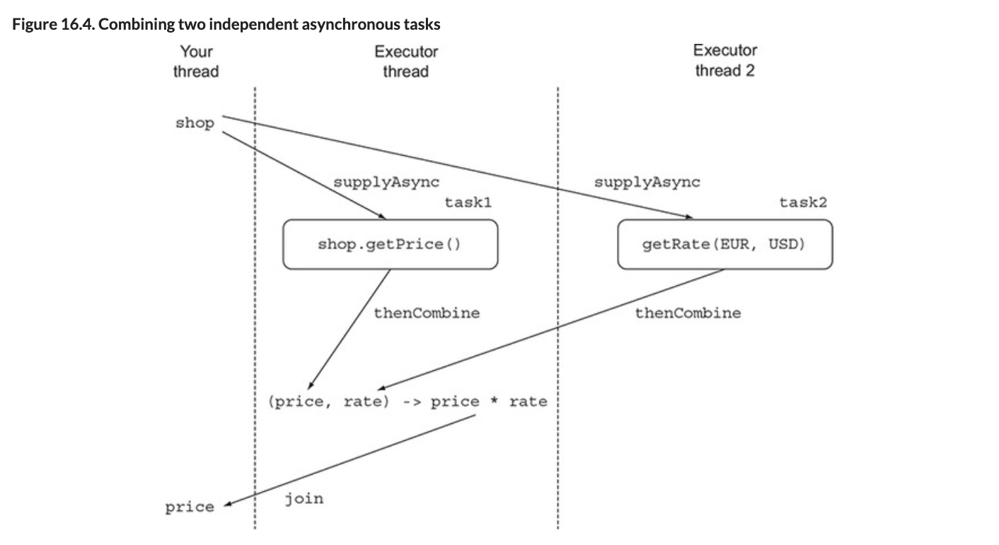


### `4.5 Future의 리플렉션과 CompletableFuture의 리플렉션`
- CompletableFuture는 람다 표혐식을 사용한다.
- 덕분에 복잡한 연산들을 선언형 api로 정의할 수 있다.
- 아래는 자바 7을 통해 CompletableFuture를 사용하면서 가독성이 얼마나 좋은지 확인해보자.
```java
ExecutorService executor = Executors.newCachedThreadPool(); //ExecutorService 생성
final Future<Double> futureRate = executor.submit(new Callable<Double>() {
        public Double call() {
            return exchangeService.getRate(Money.EUR, Money.USD); // 환율을 가져올 Future생성
        }});
Future<Double> futurePriceInUSD = executor.submit(new Callable<Double>() {
        public Double call() {
            double priceInEUR = shop.getPrice(product);  // 두번쨰 Future로 가격 검색
            return priceInEUR * futureRate.get(); // 가격검색 Future를 이용해 값 합치기 
        }});
```
- executor에 환율검색 Callable을 submit인수로 전달해서 첫번째 Future로 전달했다.
- 상점에서 가격을 EUR로 변환하는 두번쨰 Future을 만들었다.
- 마지막으로 가격정보를 환율과 곱합다.
- 4.4d의 예제에서 thenCombine 대신 thenCombineAsync를 사용한다면 가격정보를 곱하는 세번째 Future를 만드는것과 같다.  


### `4.6 타임아웃 효과적으로 사용하기`
- Future의 결과를 읽을때는 무한정 기다리는 상황이 발생할수 있으므로 블록하지 않는것이 좋다.
- 자바 9에서는 CompletableFuture의 몇몇 기능을 이용해 문제해결이 가능하다.
- orTimeOut메서드는 지정된 시간이 지난 뒤에 CompletableFuture를 TimeoutException으로 완료하면서 또 다른 CompletableFuture를 반환할수 있도록 ScheduledThreadExcutor를 활용한다.
- 이 메서드를 활용하면 파이프라인연결에서 TimeoutException이 발생했을때 사용자에게 이해하기 쉽게 메세지를 제공할 수 있다. 
```java
Future<Double> futurePriceInUSD =
        CompletableFuture.supplyAsync(() -> shop.getPrice(product))
        .thenCombine(
            CompletableFuture.supplyAsync(
                () ->  exchangeService.getRate(Money.EUR, Money.USD)),
            (price, rate) -> price * rate
        ))
        .orTimeout(3, TimeUnit.SECONDS);
        // 3초뒤에 작업이 완료되지 않으면 timeOutException이 발생됨
```
- 일시적으로 서비를 사용할수 없을때 꼭 서버에서 얻은값이 아닌 미리 지정된 임의의 값을 사용할수도 있다.
- 예를 들어 환율 서비스에서 1초이내 응답이 와야하지만 전체 계산을 Exception으로는 처리 하지 않는다 가정하자.
- 미리 정의한 환율로 계산을 마치도록 completeOnTimeout메서드를 활용할 수 있다.
```java
Future<Double> futurePriceInUSD =
        CompletableFuture.supplyAsync(() -> shop.getPrice(product))
        .thenCombine(
            CompletableFuture.supplyAsync(
                () ->  exchangeService.getRate(Money.EUR, Money.USD))
              .completeOnTimeout(DEFAULT_RATE, 1, TimeUnit.SECONDS), //결과가 1초이내 나오지 않으면 DEFAULT_RATE 사용
            (price, rate) -> price * rate
        ))
        .orTimeout(3, TimeUnit.SECONDS);
```
- orTimeout과 completeOnTimeout은 CompletableFuture를 반환하므로 다른 CompletableFuture과 연결이 가능하다. 
- 이제 모든 검색결과를 기다리지않고 이용가능한 가격정보를 즉시 사용자에게 보여주도록 다른 방식으로 종료에 대응하도록 해보자.


## 4. CompletableFuture의 종료에 대응하는 방법
- 우리의 예제들은 1초지연으로 원격메서드를 대체했다. 
- 실제의 원격 서비스들을 얼마나 지연될지 예측할 수 없다.
- 여러상점에 결과를 요청햇을때 일부 상점은 다른 상점들보다 훨씬 먼저 결과를 제공할 가능성이 크다.
- 랜덤하게 0.5초에서 2.5초의 임의의 지연으로 시뮬레이션 해보자.
```java
private static final Random random = new Random();
public static void randomDelay() {
    int delay = 500 + random.nextInt(2000);
    try {
        Thread.sleep(delay);
    } catch (InterruptedException e) {
        throw new RuntimeException(e);
    }
}
```
- 지금까지는 모든 상점에서 가격 계산을 마쳐야 정보를 가져올수 있었다.
- 이를 기다리지 말고 각 상점에서 정보를 받을때마다 즉시 보여주도록 해보자


### `5.1 최저가 검색 어플리케이션 리팩토링`
- 모든 가격정보가 올때까지 리스트생성을 기다리지 않도록 수정이 필요하다.
- CompletableFuture의 스트림을 직접 제어해야 한다. 
```java
public Stream<CompletableFuture<String>> findPricesStream(String product) {
    return shops.stream()
             .map(shop -> CompletableFuture.supplyAsync(
                                   () -> shop.getPrice(product), executor))
             .map(future -> future.thenApply(Quote::parse))
             .map(future -> future.thenCompose(quote ->
                      CompletableFuture.supplyAsync(
                          () -> Discount.applyDiscount(quote), executor)));
}
```
- 이제 findPricesStream 내부에서 세가지 map연산을 적용하고 반환하는 스트림에 네번째 map연산을 추가하자
- 새로 추가한 연산은 당순히 각 CompletableFuture에 동작을 등록한다. 
- CompletableFuture에 등록된 동작은 CompletableFuture의 계산이 끝나면 값을 소비한다.
- 자바 8의 CompletableFuture API는 thenAccept함수를 제공한다.
- thenAccept함수는 연산 결과를 소비하는 Consumer를 인수로 받는다. 
- 우리 예제에서는 할인서비스에서 반환하느 문자열이 결과이다. 
- 이제 원하는 동작은 가격과 상점명을 포함한 결과 문자열을 출력하는 것이다. 
```java
findPricesStream("Kakao").map(f -> f.thenAccept(System.out::println));
```

- thenAccept함수도 Async 버전을 제공한다.
- thenAcceptAsync는 CompletableFuture가 완료된 스레드가 아니라 새로운 스레드를 이용해 Consumer를 실행한다.
- 불핑요한 콘텍스트변경은 피하고 CompletableFuture가 완료되는 즉시 응답되는게 좋으니 Async는 피하자  
(사용시 새 스레드를 사용할수 잇을때까지 기다려야 할 수 있다.)

- thenAccept함수는 CompletableFuture가 생성한 결과를 어떻게 소비할지 이미 결정했으므로 `CompletableFuture<Void>`를 반환한다. 
- 따라서 네번째 map연산은 `<CompletableFuture<Void>>`를 반환한다. 
- 이제 `CompletableFuture<Void>`가 동작을 끝낼때까지 할수 있는 일이 없다. 

- 가장 느리게 연산되는 상점도 출력되도록 하기 위해서 스트림의 모든 `CompletableFuture<Void>`를 배열로 추가하고 결과를 기다리자. 
```java
CompletableFuture[] futures = findPricesStream("Kakao")
        .map(f -> f.thenAccept(System.out::println))
        .toArray(size -> new CompletableFuture[size]);
CompletableFuture.allOf(futures).join();
```
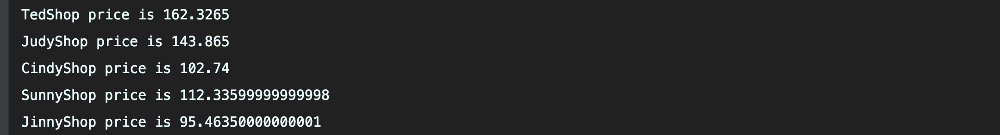

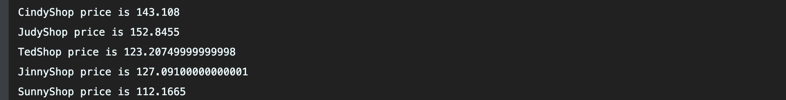


- 팩토리 메서드 allOf는 CompletableFuture를 배열로 입력 받아 `CompletableFuture<Void>`를 반환한다.
- 전달된 모든 CompletableFuture가 완료되어야 `CompletableFuture<Void>`가 완료된다. 
- 이를 이용해서 '모든 검색결과가 출력되거나 타임아웃이 발생함'을 고객한테 보여줄수 있다. 
- 반대로 배열의 CompletableFuture중 하나의 작업이 끝나기를 기다리는 상황도 있다.   
(예를 들어 두 환율 사이트에 접속해 둘중 하나의 결과만 받아도 된다.)
- 이럴때는 팩터리 메소드 anyOf를 사용한다.


### `5.2 응용`
- 개선점을 좀더 명확하게 확인하기 위해서 지연 시간이 출력될수 있도록 소스를 바꿔보자
```java
long start = System.nanoTime();
CompletableFuture[] futures = findPricesStream("Melon")
        .map(f -> f.thenAccept(
             s -> System.out.println(s + " (done in " +
                  ((System.nanoTime() - start) / 1_000_000) + " msecs)")))
        .toArray(size -> new CompletableFuture[size]);
CompletableFuture.allOf(futures).join();
System.out.println("All shops have now responded in "
                   + ((System.nanoTime() - start) / 1_000_000) + " msecs");
```
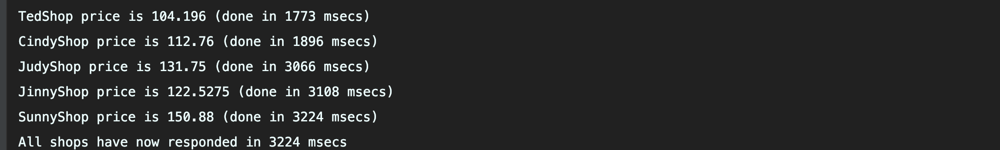