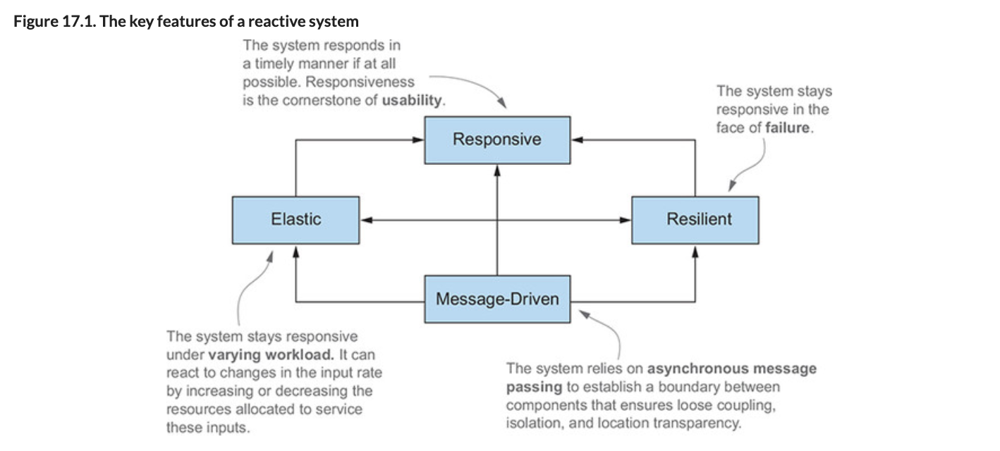
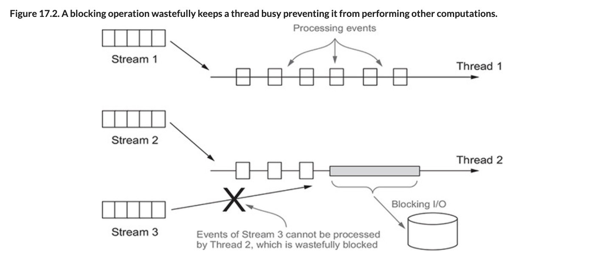
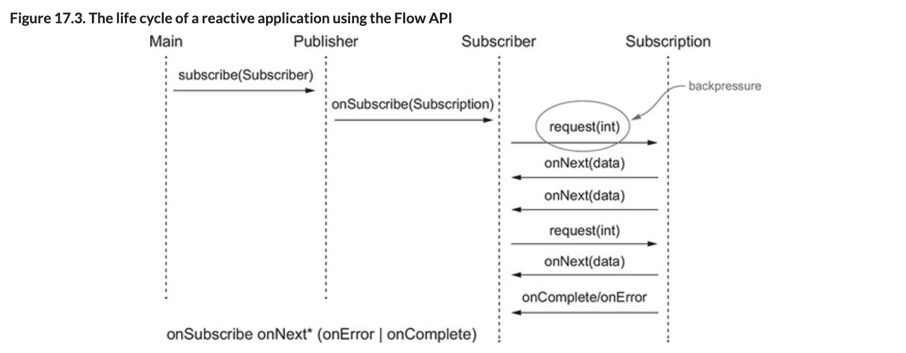
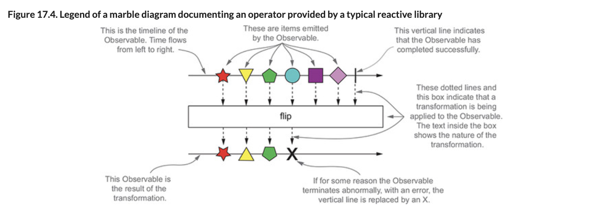
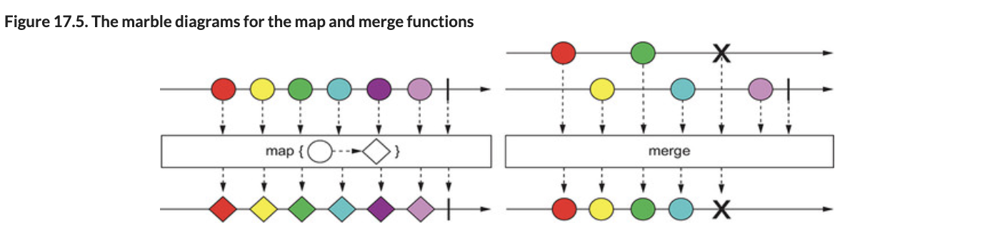

# Chapter17# 리액티브 프로그래밍

- 리엑티브 프로그래밍을 알아보기 앞서 리액티브 프로그래밍 패러다임의 중요성이 증가하는 이유를 살펴보자
- 기존의 대규모 어플리케이션은 수십대의 서버, GB의 데이터, 수초의 응답, 몇시간의 유지보수등이 필요했다. 
- 요즘은 아래같은 세가지 이유로 세상이 변하고 있다.
   - 빅데이터 : 페타데이터단위로 배일 증가한다.
   - 다양한 환경 : 모바일 디바이스에서 수천개의 멀티코어의 클라우드까지 다양한 환경에 어플리케이션이 배포된다.
   - 사용패턴 : 사용자는 1년내내 서비스를 이용하며 밀로초 단위의 응답을 기대한다.
- 기존의 소프트웨어 아키텍처로는 이런 요구사항을 만족시킬 수 없다.

- 리액티브 프로그래밍에서는 다양한 시스템과 소스에서 들어오는 데이터 스트림을 비동기적으로 처리해 문제를 해결하여 사용자에게 높은 응답성을 제공한다.
- 또한, 하

## 1. 리엑티브 매니패스토
- 리액티브 매니패스토는 2013-2014에 걸쳐 Jonas Boner, Dave Farley, Roland Kuhn, Martin Thompson에 의해 개발되었으며 핵심원칙은 아래와 같다.
  - 반응성(Responsive)  
  리액티브 시스템은 빠를 뿐만 마니라 더 중요한 특징으로 일정하고 예상할 수 있는 반응 시간을 제공한다. 사용자가 기대치를 가질수 있으며, 기대치를 통해 확신이 증가하면서 사용할 수 있는 어플리케이션이라는 확인을 제공할 수 있다. 
  - 회복성(Resilient)  
  장애가 발생해도 시스템은 반응해야 한다. 컴포넌트 실행복제, 여러 컴포넌트의 시간(발송자와 수신자가 독립적 생명주기를 가진)과 공간(발송자와 수신자가 다른 프로레스에서 실행됨)분리, 각 컴포넌트가 비동기적으로 작업을 다른 컴포넌트에 위임하는 등 리액티브 매니패스토는 회복성을 달성할 수 있는 다양한 기법을 제시한다.
  - 탄력성(Elastic)  
  어플리케이션의 생명주기동안 다양한 작업 부하를 받게 되는데 이 다양한 작업 부하로 어플리케이션의 반응성이 위협받을 수 있다. 리액티브 시스템에서는 작업부하가 발생하면 자동으로 관련 컴포넌트에 할당된 자원 수를 늘린다. 
  - 메세지 주도(Message-driven)  
  회복성과 탄력성을 지원하려면 약한 결합, 고립, 위치 투명성등을 제공할 수 있도록 시스템을 구성하는 컴포넌트의 경계를 명확하게 정의해야 한다. 비동기 메세지를 전달해 컴포넌트끼리 통신이 이루어진다. 이 덕분에 회복성(장애를 메세지로 처리)과 탄력성(주고받은 메세지 수를 감시하고 양에따른 리소스할당)을 얻을 수 있다. 

- 아래 그림은 네가지 기능의 관계와 각각 다른기능에 의존하는지 보여준다.
- 이 원칙들은 작은 어플리케이션 구조부터 여러 어플리케이션이 어떻게 큰 시스템을 구성할지에 이르기까지 다양하게 적용할 수 있다. 



### `1.1 어플리케이션 수준의 리액티브`
- 어플리케이션 수준 컴포넌트 리액티브 프로그래밍의 주요 기능은 비동기로 작업을 수행 할 수 있다는 점이다.   
17장의 나머지 부분에서는 이벤트 스트림을 블록하지 않고 비동기로 처리하는것이 최신 멀티코어 CPU의 사용률을 극대화 할 수 있는 방법이다.  
이 목표를 당설할 수 있도록 리액티브 프레임워크/라이브러리는 스레드를 퓨처, 액터, 일련의 콜백을 발생시기는 이벤트 루프등과 공유하고 처리할 이벤트를 변환하고 관리한다. 

- 이 기술들은 스레드보다 가벼우며, 개발자 입장에서는 동시/비동기 어플리케이션 구현의 추상 수준을 높일 수 있으므로 동기블록, 경쟁조건, 데드락등의 멀티스레드를 직접처리하지않아 비지니스 로직에 집중할 수 있다. 
- 스레드를 다시 쪼개는 기술을 이용할 때에는 메인 이벤르 루프에서 절대 동작을 블럭시키지 않아야한다는 전제조건이 항상 따른다.  
데이터 베이스나 파일시스템 접근, 원격 작업모듈 호출들 모든 I/O동작이 블록동작에 속한다.

- 두 스레드를 포함하는 풀이 있고 이벤트 스트림 세 개를 처리하는 상황을 가정하자.  
한번에 두개의 스트림만 처리할수있는 상황이므로 가능한 스트림은 이 두 스레드를 효율적으로 공정하게 공유해야한다. 
- 어떤 스트림 이벤트를 처리중에 파일시스템 또는 DB적근등 느린 I/O 작업이 실행되었다.
- 아래 그림이 보여주는 것처러 이런 상황에서 스레드2는 I/O동작이 끝나기를 기다리면서 소모된다.
- 스레드 1은 계속 스드림을 처리할수 있지만, 이전의 동작이 끝나기 전까지 세번째 스트림은 처리될 수 없다.



- RxJava, Akka 같은 리액티브 프레임워크는 별도로 저장된 스레드풀에서 블록동작을 실행시켜 이 문제를 해결한다.
- 메인풀의 모든 스레드는 방해 받지 않고 실행되므로 CPU는 최적으로 동작할 수 있다.
- CPU작언돠 I/O관련 작업을 분리하면 좀 더 세밀하게 풀의 크기를 설정가능하고 두 종류의 작업 성능을 관찰 할 수 있다. 


### `1.2 시스템 수준의 리액티브`
- 리액티브 시스템은 여러 어플리케이션이 하나의 일관적인, 회복할 수 있는 플랫폼을 구성할수 있게 해줄 뿐 아니라, 하나가 실패해도 전체 시스템은 운영될 수 있도록 하는 소프트웨어 아키텍쳐이다.
- 리액티브 **어플리케이션**은 비교적 짧은시간동안만 유지되는 데이터 스트림에 기반한 연산을 수행하며 보통 이벤트 주도로 분류된다. 
- 반면 리액티브 **시스템**은 어플리케이션을 조립하고 상호 소통을 조절한다. 

- 메세지는 정의된 목적지 하나를 향하는 반면, 이벤트는 관련 이벤트를 관찰 하도록 등록한 컴포넌트가 수신한다는 점이 다르다.
- 리액티브 시스템에서는 수신자와 발신자가 각각 수신메세지, 발신메세지와 결합하지 않도록 메세지를 비동기로 처리해야 한다.
- 각 컴포넌트를 완전히 고립하려면 이들이 결합되지 않도록해야만 시스템이 장애(회복성)와 높은 부하(탄력성)에서도 반응성을 유지할 수 있다.

- 더 정확하게는 리액티브 아키텍처에서는 컴포넌트에서 발생한 장애를 고립시킴으로서 문제가 다른 컴포넌트로 전파되어 전체 시스템 장애로 이어지는 것을 막아 회복성을 제공한다.  
즉, 회복성은 결함서용능력(fault-tolerance)과 같은 의미를 지닌다.
- 시스템에 장애가 발생했을때 서서히 성능이 저하되는것이 아닌 문제를 격리함으로서 장애에서 완전히 복구되어 시스템이 건강한 상태로 돌아온다. 
- 이는 에러전파를 방지하고 이들을 메세지로 바꿔 다른컴포넌트로 보내는 등 감독자 역할을 수행함으로서 이뤄진다.  

- 고립과 비결합이 회복성의 핵심이라면 탄력성의 핵심은 위치투명성이다.
- 위치투명성이란 시스템의 모든 컴포넌트가 수신자 위치에 상관없이 다른 서비스와 통신할수 있다는것을 의미한다.
- 덕분에 시스템을 복제할수 있고 현재 작업부하에따라 자동으로 확장이 가능한다.  
- 위치를 따지지않는 확장성은 리액티브 어플리케이션과 리액티브 시스템의 차이점을 보여준다.


## 2. 리액티브 프로그래밍과 플로 API
- 리액티브 프로그래밍은 리액티브 스트림을 사용하는 프로그래밍이다.
- 리액티브 스트림은 무한의 비동기 데이터를 순서대로, 블록하지 않는 업압력을 전제해 처리하는 표준 기술이다.
- 역압력(backpressure)이란 발행-구독 프로토콜에서 발생자가 이벤트를 제공하는 속도보다 구독자의 소비가 느릴때 문제가 발생하지 않도록 하는 장치이다.
- 이런 상황이 되었을때 부하가 발생한 컴포넌트가 완전 불능이 되거나 예기치 않게 이벤트를 잃어버리는 문제를 방지한다.
- 부하가 발생한 컴포넌트는 이벤트 발생속도를 늦추도록 알리거나, 얼마나 많은 이벤트를 수신 할 수 있는지, 기존의 데이터를 처리하는데 얼마나 걸리는지등을 업스트림 발행자에게 알려야 한다.

- 스트림처리의 비동기적인 특성상 역압력 기능 내장은 필수이다.
- 비동기 작업을 하는동안 암묵적으로 API가 자원을 블록하므로 자원이 낭비된다.
- 비동기 API를 이용하더라도 하드사용률은 극대화 할 수 있으나 다른 느림 다운스트림 컴포넌트에 부하가 생길 수 있다.
- 따라서 이들 기법은 데이터 수신자가 스레드를 블록하지 않고도 데이터 수신가자 처리할수 없을만큼 많은 데이터를 받는것을 방지하는 프로토콜을 제공한다.

- 넷클릭스, 레드햇, 트위터, 라이트벤드등은 리액티브 스트림이 구형해야하는 최소 기능 집합을 네게의 인터페이스로 정의했다. 
  - 자바9의 java.util.concurrent.Flow
  - Akka 스트림(라이트벤드)
  - 리액터 Reactor(피보탈)
  - RxJava(넷플릭스)
  - Vert.v(레드햇)


### `2.1 Flow 클래스 소개`

- 자바 9에서는 리액티브 프로그래밍을 제공하는 클래스 java.util.concurrent.Flow를 추가했다. 
- 이 클래스는 하나의 정적 컴포넌트를 포함하며 인스턴스화 할수 있다. 
- 리액티브 스트림 프로젝트의 표준에 따라 발행-구독 모델을 지원할 수 있도록 아래 충접된 네 인터페이스를 포함한다.
  - Publisher
  - Subscriber
  - Subscription
  - Processer
- Publisher가 항목을 발행하면 Subscriber가 하나 또는 여러 항목을 소비하는데 이 과정은 Subscription이 관리한다.
- Publisher는 수많은 이벤트를 제공할수 있지만, Subscriber의 요구사항에따라 역압력 기법(backpressure mechanism)으로 이벤트 제공 속도가 제한된다.
- Publisher는 자바함수형 인터페이스로, Subscriber는 Publisher가 발행한 이벤트 리스너로 자신으 등록할 수 있다.
- Subscription는 이 둘사이의 제어흐름과 역압력을 관리한다.

- Flow.Publisher 인터페이스
```java
@FunctionalInterface
public interface Publisher<T> {
    void subscribe(Subscriber<? super T> s);
}
```

- Subscriber 인터페이스는 Publisher이벤트 발행 시 호출할 수 있도록 4개의 콜백 메서드를 정의한다.
```java
public interface Subscriber<T> {
    void onSubscribe(Subscription s);
    void onNext(T t);
    void onError(Throwable t);
    void onComplete();
}
```
- 이들 이벤트는 다음 프로토콜에서 정의한 순서로 지정된 메서드 호출을 통해 발행되어야 한다. 
```java
onSubscribe onNext* (onError | onComplete)?
```
- 위 표기는 onSubscribe 항상 처음 호출되고 onNext는 여러번 호출될수 있음을 의미한다.
- 이벤트 스트림은 영원히 지속되거나 아니면 onComplete 콜백을 통해 데이터가 없고 종료됨을 알릴 수 있다.
- 또는, Publisher에 장애가 발생하였을때는 onError를 호출할수 있다. 

- Subscriber가 Publisher에 자신을 등록할때 Publisher는 처음으로 onSubscribe 메서드를 호출해 Subscrpition객체를 전달한다. 
- Subscrpition 인터페이스는 두 개의 메서드를 정의한다. 
  - 첫번째 메서드로 Publisher에게 주어진 갯수의 이벤트를 처리할 준비가 되었음을 알린다.
  - 두번째 메서드로는 Subscrpition을 취소 즉, Publisher에게 더이상 이벤트를 받지 않음을 알린다.
```java
  public interface Subscription {
    void request(long n);
    void cancel();
}
```

- 자바 9의 플로명세서에서는 이들 인터페이스가 어떻게 협력해야 하는지 규직 집합을 정의한다.
  - Publisher는 반드시 Subscrpition의 request메서드에 정의된 갯수 이하 요소만 Subscriber에게 전달해야한다.  
  Publisher는 지정된 갯수 이하의 요소만 onNext로 전달할 수 있으며, 동작이 끝난 경우 onComplete, 문제가 발생하면 onError를 호출해 Subscrpition을 종료한다.
  - Subscriber는 요소를 받아 처리할수 있음을 Publisher에 알려야한다.  
  이런방식으로 Subscriber는 Publisher에게 역압력을 행사 할 수 있고 관리할수 없을만큼 많은 요소를 받는 일을 피할 수 있다.  
  또한, onComplete나 onError를 처리하는 상황에서 Subscriber는 Publisher나 Subscrpition의 어떠한 메서드도 호출 할 수 없으며 Subscrpition이 취소되었다고 가정해야한다.  
  Subscriber는 Subscrpition.request()메서드 호출 없이도 언제든 종료 시그널을 받을 준비가 되어있어야 하며, Subscrpition.cancel()이 호출된 이후라도 한개이상의 onNext()를 받을 준비가 되어 있어야 한다.
  - Publisher와 Subscriber는 Subscrpition 를 공유해야하먀 각각 고유한 역할을 수행해야 한다.  
  그러려면, onSubscribe와 onNext 메서드에서 Subscriber는 request메서드를 동기적으로 호출할 수 있어야한다.   
  표준에서는 cancel을 여러번 호출하더라도 한번 호출한 것과 같이 작동되어야하며, 어러번 이 메서드를 호출해도 다른 호출에 문제되지 않도록 쓰레드에 안정정이어야 한다고 명시한다  
  같은 Subscriber객체에 다시 가입하는것이 권장되진 않지만 이러한 상황에 에러가 발생해야 한다고 강제되지는 않는다. 
- 아래 그림은 플로  API가 정의하는 인터페이스 구현의 생명주기를 보여준다.




- Flow 클래스의 네번째 Processor인터페이스는 단순히 Publisher와 Subscriber를 상속받을 뿐 아무 메서드도 추가하지 않는다.
```java
public interface Processor<T, R> extends Subscriber<T>, Publisher<R> { }
```
- 실제 이 인터페이스는 리액티브 스트림에서 처리하는 이벤트의 변환단계를 나타낸다.
- Processor가 에러를 수신하면 이로부더 회복하거나 즉시 onError 신호로 모든 Subscription에 에러를 전파할 수 있다.
- 그리도 마지막 Subscriber가 Subscption을 취소하면 Processor는 자신의 업스트림 Subscription을 취소함으로 취소신호를 전파해야한다.

- 자바 9 플로 API/리액티브 스트림API에서는 Subscriber가 인터페이스의 모든 메서드 구현이 Publisher를 블록하지 않도록 강제하지만 이들 메서드가 이벤트를 동기나 비동기로 처리되도록 강제하지는 않는다.
- 하지만 이 인터페이스로 정의된 모든 메서드는 void를 반환하므로 온전히 비동기로 구현할 수 있다.


### `2.2 첫번째 리액티브 어플리케이션 만들기`
- Flow클래스에 정의된 인터페이스 대부분은 직접 구현하도록 의도된것은 아니나 자바9 라이브러리는 이들 인터페이스를 구현하는 클래스를 제공하지 않는다.  
(Akka,RxJava등에서는 구현했다.)
- 자바 9  java.util.concurrent.Flow명세는 이들 라이브러리가 준수해야할 규직과 이를 이용해 개발된 어플리에시연들이 서로 협동하고 소통할수 있는 공용어를 제시한다. 
- 자바 9 플로 API를 직접이용한 첫 리액티브 어플리케이션을 개발하면서 앞서 배운 네 인터페이스 동작을 확인해보자. 

- 이 프로그램은 두 컴포넌트를 포함한다
  - TempInfo, 원격 온도계를 흉내낸다(0~99의 임의의 화씨운도는 만들어 연속적으로 보고)
  - TempSubsriber, 레포트를 관찰하며 각 도시에 설치된 센서에 온도를 출력
- 현재 보고된 온도를 전달하는 간단한 클래스를 정의하자.
```java
public class TempInfo {

    public static final Random random = new Random();

    private final String town;
    private final int temp;

    public TempInfo(String town, int temp) {
        this.town = town;
        this.temp = temp;
    }

    public static TempInfo fetch(String town) {
        if (random.nextInt(10) == 0)
            throw new RuntimeException("Error!");
        return new TempInfo(town, random.nextInt(100));
    }

    @Override
    public String toString() {
        return town + " : " + temp;
    }

    public int getTemp() {
        return temp;
    }

    public String getTown() {
        return town;
    }
}
```

- Subscriber가 요청할때마다 해당 도시의 온도를 적용하도록 Subscription을 구현한다.
```java
import java.util.concurrent.Flow.*;

public class TempSubscription implements Subscription {

    private final Subscriber<? super TempInfo> subscriber;
    private final String town;

    public TempSubscription( Subscriber<? super TempInfo> subscriber,
                             String town ) {
        this.subscriber = subscriber;
        this.town = town;
    }

    @Override
    public void request( long n ) {
        for (long i = 0L; i < n; i++) { // Subscriber가 만든 요청을 반복
            try {
                subscriber.onNext( TempInfo.fetch( town ) ); // 현재 온도를 Subscriber로 전달
            } catch (Exception e) {
                subscriber.onError( e ); //온도 가져오기 실패시 Subscriber로 에러 전달
                break;
            }
        }
    }

    @Override
    public void cancel() {
        subscriber.onComplete(); // 구독이 취소되면 Subscriber로 완료 전달
    }
}
```

- 이제 새 요소를 얻을때마다 Subscription이 온도를 출력하고 새 레포드를 요청하는 Subscriber를 구현한다.
```java
import java.util.concurrent.Flow.*;

public class TempSubscriber implements Subscriber<TempInfo> {

    private Subscription subscription;

    @Override
    public void onSubscribe( Subscription subscription ) { //구독을 요청하고 첫번째 요청을 전달
        this.subscription = subscription;
        subscription.request( 1 );
    }

    @Override
    public void onNext( TempInfo tempInfo ) { //수신한 온도를 출력하고 다음 정보를 요청
        System.out.println( tempInfo );
        subscription.request( 1 );
    }

    @Override
    public void onError( Throwable t ) { // 에러 발생시 메세지 출력
        System.err.println(t.getMessage());
    }

    @Override
    public void onComplete() {
        System.out.println("Done!");
    }
}
```
- 이제 리액티브 어플리케이션이 작동할수 있도록 Publisher를 만들고 TempSubsciber를 이용해 Publisher를 구독하도록 Main 클래스를 만들자.
```java
import java.util.concurrent.Flow.*;

public class Main {
    public static void main( String[] args ) {
        getTemperatures( "New York" ).subscribe( new TempSubscriber() ); 
        // 뉴욕에 Publisher를 만들고 TempSubsciber를 구독시킴
    }

    private static Publisher<TempInfo> getTemperatures( String town ) {
        // 구독한 Subsciber에게 TempSubsciption을 전송하는 Publisher를 반환
        return subscriber -> subscriber.onSubscribe(
                                new TempSubscription( subscriber, town ) );
    }
}
```
- 여기서 getTemperatures메서드는 Subscriber를 인수로 받아 Subscriber의 onSubscribe 메서드를 호출한다.
- 람다 시그니처가 Publisher의 함수형 인터페이스의 유일한 메서드와 같은 시그니처를 가지므로 자바 컴파일러는 자동으로 람다를 Publisher로 바꿀 수 있다.
- main메서든ㄴ 뉴욕의 온도를 보고할 Publisher를 만들고 새 
TempSubsciber 클래스를 자신에게 구독시킨다. 
- 이제 다음과 같은 결과가 출력된다. 
```
New York : 44
New York : 68
New York : 95
New York : 30
Error!
```
> 앞선 코드에서는 TempInfo에서 임의로 에러를 발생시켯다. 하지만 이 코드없이 오랜시간 main을 호출한다면...?  
> TempSubsciber가 새로운 onNext를 받을때마다 TempSubsciption으로 새 요청을 보내면 request 메서드가 TempSubsciber 자신에게 또 다른 요소를 보내 재귀호출이 발생한다.  
> 결과적으로 스택오버플로가 일어날때까 계속 재귀호출을 하게된다. 

- 이 문제를 어떻게 해결할 수 있을까?
- Excutor를 TempSubsciption으로 추가한 다ㅇ음 다른 스레드에서 TempSubsciber로 세 요소를 전달하는 방법이 있다. 
- TempSubsciption을 수정하자
```java
import java.util.concurrent.ExecutorService;
import java.util.concurrent.Executors;

public class TempSubscription implements Subscription {

    private static final ExecutorService executor =
                                       Executors.newSingleThreadExecutor();

    @Override
    public void request( long n ) {
        executor.submit( () -> { // 다른스레드에서 다음요소를 구독자에게 보낸다.
            for (long i = 0L; i < n; i++) {
                try {
                    subscriber.onNext( TempInfo.fetch( town ) );
                } catch (Exception e) {
                    subscriber.onError( e );
                    break;
                }
            }
        });
    }
}
```

### `2.3 Processor로 데이터 변환하기`
- 앞서서는 세개의 인터페이스만 활용했다. 이제 Processor인터페이스를 활용해 보자
- Processor는 Subscriber이며 동시에 Publisher다. 
- Processor의 목적은 Publisher룰 구독한 다음 수신한 데이터를 가공해 다시 제공하는 것이다.

- 화씨를 섭씨로 변환하는 예제를 통해 Processor를 구현해 보자
```java
import java.util.concurrent.Flow.*;

public class TempProcessor implements Processor<TempInfo, TempInfo> {

    private Subscriber<? super TempInfo> subscriber;

    @Override
    public void subscribe( Subscriber<? super TempInfo> subscriber ) {
        this.subscriber = subscriber;
    }

    @Override
    public void onNext( TempInfo temp ) {
        subscriber.onNext( new TempInfo( temp.getTown(),
                                       (temp.getTemp() - 32) * 5 / 9) ); // 섭씨로 변환루 TempInfo 다시 전송
    }
    
    // 다른 모슨 신호는 업스트림 구독자에 전달.
    @Override
    public void onSubscribe( Subscription subscription ) {
        subscriber.onSubscribe( subscription );
    }

    @Override
    public void onError( Throwable throwable ) {
        subscriber.onError( throwable );
    }

    @Override
    public void onComplete() {
        subscriber.onComplete();
    }
}
```
- TempProcessor에서 유일하게 로직을 포함하는 메서드 onNext는 화씨를 섭씨로 변환한 다음 온도를 재 전송한다.
- 그 외 다른 메서드들은 단순히 업스트림에 신호를 전달하고 등록하는 역할이다.

- main메서드를 구현하자 
```java
import java.util.concurrent.Flow.*;

public class Main {
    public static void main( String[] args ) {
        getCelsiusTemperatures( "New York" ) //섭씨온도를 전송할 Publisher
            .subscribe( new TempSubscriber() ); // TempSubscriber를 Publisher로 구독
    }

    public static Publisher<TempInfo> getCelsiusTemperatures(String town) {
        return subscriber -> {
            TempProcessor processor = new TempProcessor(); //TempProcessor를 만들고 Subscriber와 반환된 Publisher사이로 연결
            processor.subscribe( subscriber );
            processor.onSubscribe( new TempSubscription(processor, town) );
        };
    }
}
```
- 아래와 같은 결과가 출력된다. 
```
New York : 10
New York : -12
New York : 23
Error!
```

### `2.4 자바는 왜 플로 API를 구현하지 않는가`
- 자바 라이브러리는 보통 인터페이스와 구현을 제공하는 반면 플로는 제공하지 않으므로 우리가 직접 구현했다.
- 인터페이스는 프로그램의 구조를 만드는데 도움이 될 수는 있지만 프로그램을 더 빨리 구현하는데 도움이 되지는 않는다.
- API를 만들 당시 Akka, RxJava등등 다양한 리액티브 스트림 자바 라이브러리가 이미 존재했기 때문이다. 
- 같은 발행-구독사상에 기반에 리액티브 프로그래밍은 구현했으나, 이들은 독립적으로 구현되었고 서로 다른 네이밍과 API를 사용했다. 
- 자바 9 표준화 과정에서 이들은 공식적으로 java.util.concurrent.Flow의 인터페이스 기반으로 구현하도록 진화되어 다양한 라이브러리가 현력할 수 있게되었따.

## 3. 리액티브 라이브러리 RxJava사용하기 
- RxJava는 넷플릭스의 Reactive Extensions프로젝트로 시작되었으며 Reactive Steams API와 java.util.concurrnt.Flow를 지원하도록 RxJava 2.0 버전이 개발되었다. 
- 자바에서 외부 라이브러리를 사용할때는 import 문에서 두드러지게 확인할 수 있다.
```java
//자바 Flow 인터페이스
import java.lang.concurrent.Flow.*;
// Publisher의 구현인 Observavle클래스 이용시
import io.reactivex.Observable;
```

- 되도록 좋은 아키텍처를 유지하려면 Observable이 필요한 상황에서만 Observable를 사용하고 그렇지 않은경우 Publisher의 인터페이스를 사용하는 것이 좋다.

- 지금부터는 RxJava의 리액티브 스트림의 구현을 이용해서 온동 보고시스템을 정의한다.
- RxJava는 Flow.Publisher를 구현하는 두가지 클래스를 제공한다.

- 하나는 역압력 기능이 있는 (request메소드) Flow를 토함하는 io.reactive.Flowable 클래스이고 다른 하나는 역압력을 지원하지 않는 버전의 Publisher.io.reactive.Obervable이다 
- Publisher.io.reactive.Obervable같은 겨우는 단순한 프로그램이나 마우스 움직임같은 UI 이벤트에 더 적합하다. 

- RxJava는 천개 이하의 요소를 가진 스트림이나 마우스 움직임, 터치 이벤트등 역압력을 적요하기 힘든 GUI나 자주발생하지 않는 이벤트에는 역압력을 적용하지 않을것을 권장한다.

- 플로 API에서 역압력 시나리오는 설명했으므로 Flowable을 자세히 살펴보는 대신, 역압력을 사용하지 않는 Observable 인터페이스를 사용하는 방법을 살펴볼 것이다.
- 모든 구독자는 구독 객체의 request(Long.MAX_VALUE)를 이용해 역압력 기능을 제어할 수 있다.


### `3.1 Observable 만들고 사용하기`
- Observeble, Flowable 클래스는 다양한 종류의 리액티브 스트림을 편리하게 만들 수 있도록 여러 팩토리 메서드를 제공한다. 
- 아래처럼 미리 정의된 몇가지 요소를 이용해 간단히 Obervable을 만들 수 있다.
```java
Observable<String> strings = Observable.just( "first", "second" );
```
- 여기서 just 팩터리 메서드는 한개 이상의 요소를 이용해 이를 방출하는 Obervable로 변환한다.
- Obervable 구독자응 onNext("first"), onNext("second"), onComplete()의 순서로 메세지를 받는다.

- 사용자가 실시간으로 상호작용 하면서 지정된 속도로 이벤트를 방출할때 사용가능한 다른 Observable메서드도 있다.
```java
Observable<Long> onePerSec = Observable.interval(1, TimeUnit.SECONDS);
```
- 팩토리 메서드 interval은 onPerSec라는 변수로 Observable을 반환해 할당한다.
- 이 Observable은 0에서 시작 1초간격으로 long형식을 무한히 증가시키며 값을 방출한다.
- 이제 각 도시에서 온도 보고를 방출하는 다른 Observable을 onPerSec로 대신할 것이다.

- 최종 목표를 달성전에 중간 과정으로 이들 온도를 매초마다 출력할 수 있다.
- 그러기 위해서 onePerSec에 가입해서 매 초마다 온도를 받고 이를 이용해 관심있는 도시의 온도를 출력해야 한다.
- RxJava에서 Observable이 플로 API Publisher역할을 하며 Oberver는 Flow의 Subscriber역할을 한다. 
- RxJava Oberver 인터페이스는 자바 9의 Subscriber와 같은 메서드를 정의하며 onSubscription대신 Disposable인수를 갖는다는 점만 다르다.
- Observable은 역압력을 지원하지 않으므로 request메서드는 포함하지 않는다.
```java
public interface Observer<T> {
    void onSubscribe(Disposable d);
    void onNext(T t);
    void onError(Throwable t);
    void onComplete();
  }
```
- RxJava API는 플로 API보다 유연하다. 
- 예를들어 다른 세 메소드는 생략하고 onNext메서드의 시그니처에 해당하는 람다표현식을 전달해 Observable을 구독할 수 있다.
- 즉, 이벤트를 수신하는 Customer의 onNext멘서드만 구현하고 나머지 완료,에러처리는 아무것도 하지않는 기본동작 Observer를 만들어 Observable에 가입 가능하다.
- 이 기능을 활용해 Observable onPerSec에 가입해 매 초마다 온도를 출력하는 기능을 한줄로 구현할 수 있다. 
```java
onePerSec.subscribe(i -> System.out.println(TempInfo.fetch( "New York" )));
```

- 위 코드를 main메서드에 추가하면 아무것도 출력되지 않는데 이는 Observable이 RxJava의 연산스레드, 즉 데몬스레스에서 실행되기 때문이다.
- main프로그램은 실행하자 마자 따로 실행할 코드가 없으니 종료되고 데몬스레드도 종료되며 이런 현상이 일어난다.
- 코드뒤에 스레드 sleep 메서드를 추가해 막는 방법도 있다.
- 현재 스레드에서는 콜백을 호출하는 blockingSubscribe 메서드를 이용하면 더 깔끔하게 문제를 해결 할 수 있다.
- 이 예제에서는 blockingSubscribe이 적절하며 실제로 아래와 같이 blockingSubscribe를 사용할 것이다. 
```java
onePerSec.blockingSubscribe(
    i -> System.out.println(TempInfo.fetch( "New York" ))
);
```
- 결과는 아래와 같다.
```
New York : 87
New York : 18
New York : 75
java.lang.RuntimeException: Error!
at flow.common.TempInfo.fetch(TempInfo.java:18)
at flow.Main.lambda$main$0(Main.java:12)
at io.reactivex.internal.observers.LambdaObserver
           .onNext(LambdaObserver.java:59)
at io.reactivex.internal.operators.observable
           .ObservableInterval$IntervalObserver.run(ObservableInterval.java:74)
```
- 예제에서 구현한 Observer는 onError같은 에러 관리를 구현하지 않았으므로 사용자에게 에러가 그대로 보여진다.

- 예제 난미도를 높여 에러처리를하고 기능을 일반화 해보자
- 온도를 직접 출력하지 않고 사용자에게 팩토리 메서드를 제공해 매 초마다 온도를 방출하는 Obervable을 반환해보자
```java
public static Observable<TempInfo> getTemperature(String town) {
    return Observable.create(emitter -> //Oberver를 소미하는 함수로 부터 Observable만들기
             Observable.interval(1, TimeUnit.SECONDS) //매 초마다 long을 반환하는 Observable
                   .subscribe(i -> {
                       if (!emitter.isDisposed()) { //아직 옵저버가 폐기되지 않았으면 작업 수행
                           if ( i >= 5 ) { // 다섯번 온도 보고후 종료
                               emitter.onComplete();
                           } else { //아니면 온도를 보고
                               try {
                                   emitter.onNext(TempInfo.fetch(town));
                               } catch (Exception e) {
                                   emitter.onError(e); //에러가 발생하면 Observer에 알림
                               }
                           }
                       }}));
}
```
- 필요한 이벤트를 전송하는 ObservableEmitter를 소비하는 함수로 Observable을 만들어 반환했다.
- RxJava의 ObservableEmitter는 인터페이스는 RxJava의 기본 Emitter를 상속한다.
```java
public interface Emitter<T> {
    //onSubscribe가 빠진 Observer
    void onNext(T t);
    void onError(Throwable t);
    void onComplete();
  }
```
- Emitter는 새 Disposable을 설정하는 메서드와 시퀀스가 이미 다운스트림을 혜기했는지 확인하는 메서드등을 제공한다.

- 내부적으로 매 초마다 long값을 발행하는 onPerSec 같은 Observable을 구독했다.
- 우선 구독함수 내에서는 ObservableEmitter 인터페이스에서 제공하는 isDisposed 메서드를 히용해서 소비된 Oberver가 이미 폐기 되었는지 확인하다.
- 온도를 이미 다섯개 방출했으면 스트림을 종료하면서 Observer를 완료시키낟. 
- 그렇지 않으면 try-catch블록에서 온도를 요청된 도시의 온도를 보내거나 에러가 발생한 경우 Observer로 전달한다.

- 아래 코드에서처럼 getTemperature메서드가 반환하는 Observable에 가입할 Observer를 쉽게 작성해 온도를 출력할 수 있다. 
```java
import io.reactivex.Observer;
import io.reactivex.disposables.Disposable;

public class TempObserver implements Observer<TempInfo> {
    @Override
    public void onComplete() {
        System.out.println( "Done!" );
    }

    @Override
    public void onError( Throwable throwable ) {
        System.out.println( "Got problem: " + throwable.getMessage() );
    }

    @Override
    public void onSubscribe( Disposable disposable ) {
    }

    @Override
    public void onNext( TempInfo tempInfo ) {
        System.out.println( tempInfo );
    }
}
```
- 앞선 예제의 TempSubsdcriber클래스와 비슷하지만 더 단순한다.
- RaJava 는 역압력을 지원하지 않기때문에 전달된 요소를 처리한 뒤 추가 요소를 요청하는 request() 메서드가 필요없기 때문이다.

- 메인 프로그램을 작성해서 getTemperature메서드가 반환하는 Observable에 Observer를 구독한다.
```java
public class Main {
    public static void main(String[] args) {
        Observable<TempInfo> observable = getTemperature( "New York" );
        observable.blockingSubscribe( new TempObserver() );
    }
}
```
- 결과는 아래와 같다
```
New York : 69
New York : 26
New York : 85
New York : 94
New York : 29
Done!
```

### `3.2 Observable 변환하고 합치기`
- RxJava나 리액티브 라이브러리는 자바 9의 플로 API에 비해 스트림을 합히고 만들고 거르는 풍부한 도구상자를 제공한다.
- 앞에서는 Flow.Processor를 이용해 화씨를 섭씨로 바꿔보았다.
- 이 외에도 Flow.Processor에서는 어려운 스트림에서 관심있는것만 걸러 다른 스트림을 만들거나, 매핑요소로 변환하기, 다른 두스트림을 합치는 등 작업이 가능하다
- 예를 들어 RxJava의 mergeDelayError 함수는 아래와 같은 동작을 수행한다
  - "Observable을 한 Observable로 방출하는 Observable로 평면화해서 모든 Observable 소스에서 성공적으로 방출된 모든 항목을 Obserber가 수신할 수 있도록 한다.  
  이떼 이들중 에러 알림이 발생해도 방해받지 않으며 이들 Observable이 동시게 구독할 수 있는 숫자에는 한계가 있다. 
- 무슨소린지 모르겠다... 그래서 리액티브 스트림 커뮤니티는 "마블다이어그램"을 이용해 시각적으로 이런 어려움을 해결한다.

- 마블 다이어그램 예제



- 이 표기법을 이용하면 RxJava의 라이브러리 함수를 시각적으로 표현할 수 있다.
- 아래 그림은 map과 merge의 시각화된 예의다


- map을 이용해서 Flow.Processer보다 간편하게 화씨를 섭씨로 변환해 보자
```java
public static Observable<TempInfo> getCelsiusTemperature(String town) {
    return getTemperature( town )
                .map( temp -> new TempInfo( temp.getTown(),
                                            (temp.getTemp() - 32) * 5 / 9) );
}
```

- 영하 온도만 거르는 예제를 적용해보자
```java
public static Observable<TempInfo> getNegativeTemperature(String town) {
    return getCelsiusTemperature( town )
               .filter( temp -> temp.getTemp() < 0 );
}
```

- 한 도시 뿐아니라 여러 도시의 온도를 출력할 수 있도록 merge를 사용해보자
```java
public static Observable<TempInfo> getCelsiusTemperatures(String... towns) {
    return Observable.merge(Arrays.stream(towns)
                                  .map(TempObservable::getCelsiusTemperature)
                                  .collect(toList()));
}
```
- 위 메서드는 여러 도시집합을 가변인수로 받는다. 
- 이 가번인수를 문자열 스트림으로 변환한 뒤 각각 getCelsiusTemperatures메서드로 전달한다.
- 각 도시는 매 초라다 온도를 방출하는 Observable로 변신한다.
- 마지막으로 Observable의 스트림은 리스트로 모아진 뒤 리스트는 Observavle클래스가 제공하는 merge로 전달된다.

- 이 메서느느 Observable의 Iterable을 인수로 전달받아 하나의 Observable처럼 동작하도록 결과를 합친다. 

- 메인 메서드에 적용해보자
```java
public class Main {

    public static void main(String[] args) {
        Observable<TempInfo> observable = getCelsiusTemperatures(
                                  "New York", "Chicago", "San Francisco" );
        observable.blockingSubscribe( new TempObserver() );
    }
}
```

- 결과는 다음과 같다. 
```
New York : 21
Chicago : 6
San Francisco : -15
New York : -3
Chicago : 12
San Francisco : 5
Got problem: Error!
```