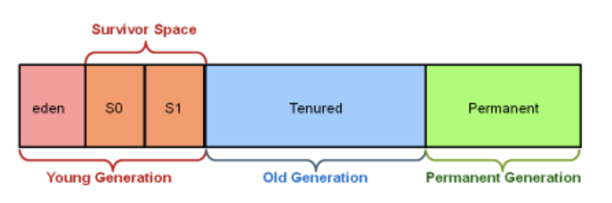

# Chapter10 자바가상머신(JVM)이해하기


## 가비지컬렉션
  
####` Q1. 메모리를 어떻게 할당 하는가`

new키워드를 사용해 heap영역에 메모리가 할당된다.
메모리가 충분하지 않으면 Garbage Collection(GC)를 이용해 메모리를 확보하며 그래도 충분치 않으면 OutOfMemoryError가 발생한다.

heap영역은 여러개의 제너레이션으로 나누어지며 GC를 통해 다른 제너레이션으로 이동한다. 

- Young : 객체가 처음 생성되면 Eden 메모리 영역에 할당되며 GC의 수집대상에서 벗어나면 Survive라는 메모리 영역으로 옮겨진다
- Old : 이후 Tenured 제너레이션에 할당된다. Tenured 제너레이션은 GC의 수집대상 빈도가 적다.
- PermArea : Permanent 제너레이션 or PermGen이라는 공간은 GC에서 수집대상으로 선택되지 않으며, 주로 클래스 정의나 String 상수같은 불변상태들이 포함된다.    
자바8에서 PermGen -> Mataspace(물리영역)으로 변경되었다. 


####` Q2.  Garbage Collection(GC)이란 무엇인가?`  

가비지 컬렉션은 기존의 할당된 메모리를 재사용 메커니즘이다.
new키워드로 객체가 생성시 메모리를 할당하고 해제 시 JVM메모리 공간을 재 배치한다.   
C,C++은 GC가 존재하지 않으므로 수동으로 메모리를 해제 해주어야 하나 JAVA는 메모리에 대한 해제를 직접 수행할 필요가 없다. 

**전통적인 알고리즘은 mark-and-sweep방식이다.**
 - 실행중인 코드에서 참조되는 객체 및 해당 객체에서 참조되는 것들이 live로 표시  
 - live로 표시 되지 않은 객체들을 찾아 해당 위치에 메모리가 할당 될 수 있도록 한다. 
 - 해당 과정에서 메모리를 재 배치하며 JVM의 스레드가 모두 정지(stop-the-world)한다.
 
**GC의 종류**
- 마이너 GC: Young 영역에서 발생하는 GC
- 메이저 GC: Old 영역이나 Perm 영역에서 발생하는 GC

**Compaction**
- 자바6에서 GC1이 처음 등장했으며 자바7에서 본격적으로 도입되었다. 
- GC1 역시 mark-and-sweep에 집중하며 가등한 많은 공간을 비우려 한다.
- 결과적으로 GC는 메모리에서 객체를 옮기고 자주 접근되는 객체를 묶어두는데 이 작업을 compaction이라고 한다. 



--------
### 메모리튜닝
  
####` Q1. 스택과 힙의 차이는 무엇인가?`  

- 스택은 기본값, 객체의 참고, 메소드가 저장되는 위치이며 스택에 있는 변수의 lifeCycle은 코드 scope에 영향을 받는다.  
- scope는 주로 메서드호출, while, for문 등에 의해 정의된다.  
- 스코프의 실행이 종료되면 스코프 안의 변수들은 스택에서 제거된다.  

- 메서드 호출 시 변수들은 스택 상단에 위치하며, 다른 메서드를 호출하면 새로운 메서드변수를 스택의 상단에 위치시킨다  

재귀메서드
- 재귀메서드는 자기 자신을 호출하는 메소드이다.
- 스스로를 너무 많이 호출하면 스택영역이 가득차 StackOverFlowError가 발생한다.
- 재귀메서드를 작성하는 경우에는 더 이상 호출이 일나지 않도록 초기조건(base case)으로 메서드 안의 상태를 지정하는 것이 중요하다.

```java
    @Test
    public void listReversals(){
        final List<Integer> givenList = Arrays.asList(1,2,3,4,5);
        final List<Integer> expectedList = Arrays.asList(5,4,3,2,1);

        Assert.assertEquals(expectedList.size(),reverseRecursive(givenList).size());
        Assert.assertEquals(expectedList.size(),reverseIterative(givenList).size());
    }

    private List<Integer> reverseRecursive(List<Integer> list){
        if(list.size() <= 1){return list;}
        else {
            List<Integer> reversed = new ArrayList<Integer>();
            reversed.add(list.get(list.size()-1));
            reversed.addAll(reverseRecursive(list.subList(0,list.size()-1)));
            return reversed;
        }
    }

    private List<Integer> reverseIterative(final List<Integer> list){
        for (int i=0;i<list.size()/2;i++){
            final int tmp = list.get(i);
            list.set(i,list.get(list.size()-i-1));
            list.set(list.size()-i-1,tmp);
        }
        return list;
    }
```
위 소스에서 배열을 뒤집는 두 메소드를 비교해보자   
- 재귀 메소드(reverseRecursive)에서는 재귀적으로 메소드를 호출할때마다 새로운 리스트가 생성되며, 리스트가 뒤집어질때까지 메모리에 남아있다.   
생성된 리스트는 힙영역에 할달되겠지만, 각 호출된 메서드들은 스택역역에 할당된다.

- 반복문 메소드(reverseIterative)에서는 변수하나만 존재히면 되며, 재귀적 호출이 없어 스택영역이 커지지 않는다.  
변수도 하나만 존재하므로 힙영역도 추가적으로 필요하지 않다. 


####` Q2. JVM의 힙 크기는 어떻게 지정할 수 있는가`  

JVM은 각 메모리영역의 할당된 크기를 설정할 수 있는 커멘드 라인을 제공한다.    

JVM 실행시에 커맨드 라인에 -Xmx 매개변수와 크기를 이용해서 최대 힙 크기를 지정가능하다.  
초기 메모리를 지정할 때엔 Xms 매개변수를 이용한다  
두 변수를 같게 지정하면 실행시 모든 메모리가 할당되며 더 확장되지 않는다.   
```command
java -Xmx512M <className>
java -Xms128M <className>
```
메모리 할당을 확장하기전 가능한 많은 GC를 수행하며 JVM 실행시 메모리 전체를 할당하지 않는다.
초기 할당(Xms)을 위한 기본값은 컴퓨터 메모리의 1/64 ~ 1G까지이다 . 
최대 할당(Xmx)을 위한 기돈앖은 1G보다 작거나 컴퓨터 메모리의 1/4이다.

스택 영역도 매개변수로 지정할 수 있으나, 실행중인 프로그램 대부분에는 직접 설정하지 말아야한다.  

parmanent 제너레이션은 -XX:Persize와 -XX:MaxPerSize 매개변수로 설정 가능하다.
클래스와 String상수를 많이 자용하거나 비자바프로그래밍언어에서 동적클래스를 정의하는 경우 설정한다.

 
####` Q3. 자바에서 메모리 누수가 발생할 수 있는가?`
```java
public class MemoryLeakStack<E> {

    private final List<E> stackValues;
    private int stackPointer;

    public MemoryLeakStack(){
        this.stackValues = new ArrayList<E>();
        stackPointer = 0;
    }

    public void push(E element){
        stackValues.add(stackPointer, element);
        stackPointer++;
    }

    public E pop(){
        stackPointer--;
        return stackValues.get(stackPointer);
    }
}  
```

동시성 이슈를 무시하거나 비어있는 스택에서 pop 메서드를 호출하는 것 같은 기본적인 예외가 발생했을때 메모리 누수탐지를 관리해봤는가?
객체를 pop 했을 때 stackValues 인스턴스는 pop된 객체를 가비지걸렉션으로 수집하지 않는다. 
push메서드가 호출되어 덮어써지기 전에는 가비지컬렌션에 수집되지 않는다. 

따라서 pop메서드의 정확한 구현은 remove메서드를 호출하는 것이다. 

--------
### JVM과 자바 사이의 상호작용
  
####`Q1 JVM에서 동작하는 실제 자바 코드를 작설할때 생명주기란 무엇인가?` 

-  자바코드를 JVM d에서 실행시키기 위해선 **컴파일**을 해야한다.  
 컴파일러는 문법과 타입의 적합성등을 확인해 .class 확장자를 가진 바이트 코드 파일을 생성한다    

- class파일을 JVM 메모리로 가져오는것을 **클래스 로딩**이라고 한다.  
클래스 로더는 클래스파일을 추상화하여 디스크, 네트워크, jar등의 압축파일에서 .class 바이너리 파일을 가져와 메모리에 저장 불러올 수 있다.  

- 사용자가 직접 클래스로더를 만드는 경우엔 특정 위치의 클래스들을 클래스로더에서 사용하도록 지정이 가능하다

- 클래스가 로드되면 JVM은 바이트코드가 유효한지 **검증**하고 코드의 명령어가 완벽지 확인한다.

- 검증이 완료되면 JVM 아키텍쳐와 운영체제에 맞게 **바이트코드를 해석**한다.  
JLT컴파일러는 직접 동적으로 실행중인 바이트코드를 명령어로 해석하며 동적으로 최적화된 머신코드를 만들수 있다. 

 
####`Q2 JVM에게 가비지컬렌션 실행하라고 직접 명령 할 수 있는가?` 

gc는 System 클래스의 전역메서드로 JVM에 가비지 컬렉션을 실행하라고 명령한다.
그러나 이 메서드를 실행한다고 반드시 가비지 컬렌셕이 실행되지는 않는다.

JVM은 gc 메서드의 요청을 받아 가능하다면 가비지컬렌셕을 실행하고 실행하는 동안 stop-the-world상태가 된다.  
해당 시간동안 모든 스레드가 정지하므로 어플리케이션의 코드실행이 느려질 수 있다.

####`Q3 finalize 메서드는 어떤 역할을 수행하는가?`
 finalize, 소멸자(<->생성자)는 Object 클래스의 protected 메서드로 가비지컬렌션이 객체를 수집할때 이 메서드를 가장 먼저 호출한다.  
 즉 가비지 컬렌션에서 메모리 해제를 위해 호출한다.
 
 오버라이딩 하는 경우 이 메서그가 언제 호출되는지 제어가 불가능 하나는 점을 염두해야한다.  
 DB연결을 종료하거나, 파일처리 종료시 이 메서드를 사용가는 경우 메서드가 정확히 실행될 것 이라고 생각하면 안된다.  
 이런식으로 설정된 객체가 많으면 DB pool 소모, 또는 많은 파일을 열어두게 될수 있다.  
 
 DB, 파일시스템, 네트워크 인터페이스 등은 가능한 빨리 자원제거를 해주는 것이 좋으며,   
 자바7의 try-with-resource를 사용하는 것이 좋다.

####`Q4 WeakReference란 무엇인가?`

WeakReference란 제너릭 컨데이너 클래스로서, 들어있는 인스턴스에 강력한 참조가 없으면 가지비컬렉션의 수집대상이 된다.  
위 메모리 누수 스택문제를 해결하기 위해서는 원소들의 WeakReferences 리스트를 유지해야 한다.  
다른 참조가 없는 원소들은 가비지 컬렉션을 실행할 때 null로 설정된다.

```java
  public class WeakReferenceStack<E> {
      
      private final List<WeakReferenceStack<E>> stackReferences;
      private int stackPoint = 0;
      
      public WeakReferenceStack(){
          this.stackReferences = new ArrayList<>();
      }
      
      public void push(E element){
          this.stackReferences.add(stackPoint,new WeakReferenceStack<E>(element));
          stackPoint==;
      }
      
      public E pop(){
          stackPoint--;
          return this.stackReferences.get(stackPoint).get;
      }
      
      public E peek(){
          return this.stackReferences.get(stackPoint-1).get();
      }
  }
```
스택에 새로운 원소가 들어오면 WeakReferenceStack객체로 저장되며,  
객체가 pop될 때에는 WeakReferenceStack 객체를 검색하고 객체를 얻기위해 get메소드가 호출된다.  
해당 객체를 가르키는 클라이언트가 없을 경우, 다음 가비지 컬렌션의 삭제대상으로 선택 될 수 있다.  

peak는 스택상단에 있는 원소를 삭제하지 않고 반환해준다.


```java
    @Test 
    public void weakReferencesStackManipulation(){
        final WeakReferenceStack<ValueContainer> stack = new WeakReferenceStack<ValueContainer>();
        
        final ValueContainer expected = new ValueContainer("Value for the stack");
        stack.push(new ValueContainer("Value for the stack"));
        
        ValueContainer peekedValue = stack.peek();
        
        Assert.assertEquals(expected,peekedValue);
        Assert.assertEquals(expected,stack.peek());
        
        peekedValue = null;
        System.gc();
        Assert.assertNull(stack.peek());
        
    }
    
    public class ValueContainer{
        private final String value;
        
        public ValueContainer(final String value){
            this.value = value;
        }
        
        @Override
        protected void finalize() throws Throwable{
            super.finalize();;
            System.out.println("Finalizing for " + toString());
        }
    }
```
 stack.push(expected)같은 형태로 객체를 삽입하면 강한 참조가 유지된다.   
 따라서 가비지 컬렉션에서 수집되지 않고 이 테스트는 실패한다. 
 
 테스트는 peek메소드를 가진 스택을 점검하고 스택에 있는 값이 원하는 값이 맞는지 확인한다. 
 peekedValue의 참조는 null로 확인하고, 스택의 weakReferences안이 아니면 참조가 없다.  
 따라서 가지비 컬렉션에서 수집대상이 되어 메모리가 재 배치 되어야 한다.
 
 JVM이 가비지컬렌션을 수행한 이후에는 해당 참조를 스택에서 사용할 수 없으며,  
 finalize가 호출되었을때 표준출력에서 메세지를 확인해야 한다.


####`Q5 native 메서드란 무엇인가?`  
Java Native Method (JNI)는 다른 언어로 작성된 코드를 자바에서 사용가능하도록 한다.

정상적인 자바 클래스는 바이트 코드로 컴파일해 클래스파일로 저장된다.  
바이트 코드는 플랫폼에 독립적으로 바이트코드를 실행하는 아키텍쳐와 운영체제의 명령어로 해석된다.  

이 경우 플랫폼의 지정코드, 라이브러리, 디스트, 네트워크 인터페이스 등에 자원을 호출해야 하며,   
대부분 JVM을 이용하는 플랫폼에 구현되어 있다.  

자원호출이 불가한 경우에는 navive메서드를 이용 할 수 있다.  
이 메서드를 통해서 클래스이름, 자바메서드 이름, 매개변수, 반환타입을 구분 가능하낟.   

####`Q6 셧다운 훅이란 무엇인가?`  
객체가 가비지컬렌션 되기 전에 finalize가 실행되듯이, JVM이 종료되기 전에 실행된다.  
즉, 어플리케이션을 안전하게 종료하기 위해 ..?
shutdown-hook은 Thread 객체에 대한 참조로서, runtime 인스턴스의 addShutDownHook메서드를 호출에 새로운 참조를 추가한다.

```java
   @Test
    public void shutdownHook(){
        Runtime.getRuntime().addShutdownHook(new Thread() {
            @Override
            public void run(){
                System.err.println("Shutting sown JVM at time : "+ new Date());
        }
        });
    }
```

셧다운 훗은 종료 코드에서 실행된다.  
위의 코드는 JVM이 종료될때 시간로그를 남기는 코드이다.
