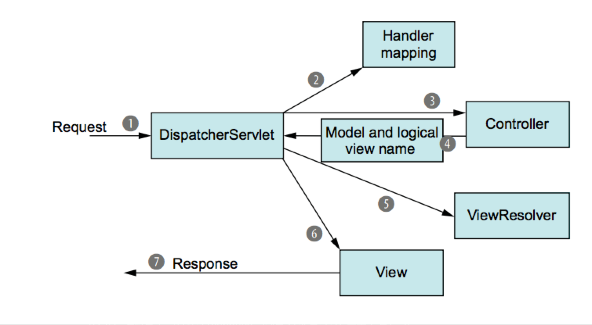

# Chapter5# Spring MVC 시작하기


## 1. Spring MVC 시작하기

### 1.1 스프링 MVC를 통한 요청 추척
 - request가 출발해 response가 가지고 올때까지 수차례 멈추며 정보를 보내고 집어오고를 반복한다  

```
(1) DispactureServlet이 프론트 컨트롤러 역할을 수행한다.
(2) DispactureServlet은 요청을 전달할 컴포넌트 선택을 위해 Handler Mapping의 도움을 받는다
     - URL주소를 기반으로 결정을 내린다.
(3) DispactureServlet는 선택된 컨트롤러에 요청을 보낸다.
    - 컨트롤러는 서비스 객체에 주요 비지니스 로직을 넘긴다.
(4) 모델과 뷰 이름을 포함하여 다시 DispactureServlet에 요청을 돌려보낸다
(5) DispactureServlet은  view Resolver에 뷰 이름과 실제 구현된 뷰를 맵핑 요청힌다.
(6) 모델 데이터를 전달해주는 뷰의 구현
(7) 뷰는 결과를 랜더링하여 response 객체를 통해 클라이언트로 전달된다. 
```

### 1.2 스프링 MVC 설정
**DispactureServlet 설정**
- 기존(서블릿3, 스프링3.1)엔 DispactureServlet을 web.xml로 설정했으나 java를 통해 설정 가능하다
- AbstractAnnotationConfigDispatcherServletInitializer를 상속받아 구현
```java
package spittr.config;

import org.springframework.web.servlet.support.AbstractAnnotationConfigDispatcherServletInitializer;
import spittr.web.WebConfig;

public class SpitterWebInitializer extends AbstractAnnotationConfigDispatcherServletInitializer {

    @Override
    protected Class<?>[] getRootConfigClasses() {
        return new Class<?>[] { RootConfig.class };
    }

    @Override
    protected Class<?>[] getServletConfigClasses() {
        return new Class<?>[] { WebConfig.class };
    }

    @Override
    protected String[] getServletMappings() {
        return new String[] { "/" };
    }
}
```

**어플리케이션 컨택스트 이야기**
- DispactureServlet이 시작되면서 어플리케이션 컨택스트를 생성하고 빈으로 로딩(클래스나 설정파일로 선언)하기 시작

- getServletConfigClasses() 메소드 : 어플리케이션 컨택스트를  WebConfig 설정클래스에서 로딩하기를 요청


**스프링 MVC 활성화하기**  

[WebConfig설정]
- 자바 기반의 스프링 MVC설정 > @EnableWebMvc 어노테이션을 븥여준다 
```java
@Configuration
@EnableWebMvc
public class WebConfig{
}
```

- 잔여작업이 남아있는 상태이다 
> 뷰리졸버 미설정 상태 : 디폴트로 BeanNamedViewResolver를 사용 (빈의 ID와 view인터페이스를 구현한 이름을 매칭시켜 뷰를 결정)  
>  컴포넌트 검색이 비활성화 상태 : 스프링이 컨트롤러를 찾으려면 명시적으로 설정에 컨트롤러를 설정해야함  
>  디폴트서블릿으로 매핑 : 이미지, css등 고정 리소스에 대해 모든 요청을 처리한다   

- 추가 설정 처리 
```java
@Configuration
@EnableWebMvc
@ComponentScan("spittr.web")
public class WebConfig extends WebMvcConfigurerAdapter {


  @Bean
  public ViewResolver viewResolver() {    // <-뷰리졸버 설정
    InternalResourceViewResolver resolver = new InternalResourceViewResolver();
    resolver.setPrefix("/WEB-INF/views/");
    resolver.setSuffix(".jsp");
    return resolver;
  }
  
  @Override
  public void configureDefaultServletHandling(DefaultServletHandlerConfigurer configurer) {  //<-정적콘텐츠 처리 
    configurer.enable();
  }

}
```
- @ComponentScan어노테이션 추가 > spittr.web 패키지에서 컴포넌트 스캔을 하여 @Controller어노테이션을 붙여주면 된다. 
- ViewResolver 빈 추가 prefix, suffix를 사용해 뷰이름을 jsp파일로 찾아줌 (ex. home > /WEB-INF/views/home.jsp)
- WebMvcConfigurerAdapter 를 상속받아 addResourceHandlers를 오버라이딩 하여 정적리소스를 처리

[RootConfig설정]
```java
@Configuration
@Import(DataConfig.class)
@ComponentScan(basePackages={"spittr"},
        excludeFilters={
                @Filter(type=FilterType.CUSTOM, value=WebPackage.class)
        })
public class RootConfig {
    public static class WebPackage extends RegexPatternTypeFilter {
}
```
-----
## 간단한 컨트롤러 작성하기

- 단순한 HomeController
```java
@Controller
public class HomeController {
  @RequestMapping(value=“/“, method = GET)
  public String home(Model model) {
    return "home";
  }
}
```
- @Controller 어노테익션이 붙어있어 컴포넌트스캐닝시 자동으로 HomeController를 스프링 어플리케이션 컨택스트에서 빈으로 선언

- home() 메소드에 @RequestMapping의 value애트리뷰드는 메소드가 처리할 요청 패스를 method는 HTTP 메소드를 명시 한다. 

    HTTP GET요청이 들어오면 home()이 호출된다  
    home() 메소드는 “home”이라는 string을 리턴하며 스프링 MVC에 의해 뷰 이름으로 해석된다.   
    DispactureServlet은 뷰 리졸버에게 뷰이름으르 실제 뷰를 결정하도록 요청한다.  
    InternalResourceViewResolver 설정방식으로 “home”이라는 뷰 이름은  /WEB-INF/views/home.jsp 위치의 JSP파일로 결정된다.   

### 2.1 컨트롤러 테스팅
- 어노테이션을 떼고 보면 단순 POJO구조이다 
- 단순히 “home”이라는 스트링이 리턴되고 뷰이름인것을 테스트 불가하다.
```java
public class HomeControllerTest {
  @Test
  public void testHomePage() throws Exception {
    HomeController controller = new HomeController();
    assertEquals(“home”, controller.home());
  }
}
```


- 스프링 3.2부터 HTTP 요청 실행을 테스트 가능
- “/“에 GET요청을 보내 뷰의 이름이 home인지 검사한다.
- HomeController의 인스턴스를 MockMvcBulider.standaloneSetup() 으로 전달해 주고 
```java
public class HomeControllerTest {
  @Test
  public void testHomePage() throws Exception {
    HomeController controller = new HomeController();
    MockMvc mockMcv = 
        standaloneSetup(controller).build();
    
    mockMcv.perform(get("/"))
            .andExpect(view().name(“home”))
  }
}
```

### 2.2 클래스 레벨 요청 처리하기
```java
@Controller
@RequestMapping("/“)            // @RequestMapping({“/“, “homepage”}) <- 여러개의 매핑도 가능함
public class HomeController {

  @RequestMapping(method = GET)
  public String home(Model model) {
    return "home";
  }

}
```
- 클래스 레벨의 @RequestMapping으로 변경, HTTP 메소드는 메소드 별로 매핑 되어 있다.
- 클래스 레벨의 @RequestMapping은 모든  핸들러 메소드에 적용되며 
- 메소드의 @RequestMapping과 클래스의 @RequestMapping이 조합되어 “/“에 대한 GET 요청을 처리하기 위한 home() 메소드를 가르킨다.

### 2.3 뷰에 모델 데이터 전달 
- Spittle를 가져오기 위한 SpittleRepository
```java
public interface SpittleRepository {
  List<Spittle> findSpittles(long max, int count);
}
//최근 20개 Spittle 객체 가져오기
// List<Spittle> recent = spittleRepository.findSpittles(Long.MAX_VALUE, 20);
```

- Spittle 클래스(생략..)
```java
public class Spittle {

  private final Long id;
  private final String message;
  private final Date time;
  private Double latitude;
  private Double longitude;
}
```

- SpittleController 클래스
```java
@Controller
@RequestMapping("/spittles")
public class SpittleController {

  private SpittleRepository spittleRepository;

  @Autowired
  public SpittleController(SpittleRepository spittleRepository) {  //<-SpittleRepository 주입
    this.spittleRepository = spittleRepository;
  }


  @RequestMapping(method=RequestMethod.GET)
  public List<Spittle> spittles(Model model){
      model.addAttribute(     //<- model에 받아온 Spittle주입
        spittleRepository.findSpittles(Long.MAX_VALUE, 20));
  
      return "spittles";
  }
}
```
---
## 3. 요청 입력받기 

- 클라이언트가 컨트롤러의 핸들러 메소드에 데이터를 전달해주는 방법들  
> 쿼리 파라미터  
> 폼 파라미터  
> 패스변수  

### 3.1 쿼리 파라미터 입력받기
- max와 count파라미터를 전달받는 핸들러 메소드 구현하여 페이징 처리

- SpittleController에 아래 메소드를 추가
- max와 count 파라미터를 지정하지 않더라더도 디폴트값이 들어가도록 설정 
```java
@RequestMapping(method=RequestMethod.GET)
  public List<Spittle> spittles(
      @RequestParam(value="max", defaultValue=MAX_LONG_AS_STRING) long max,
      @RequestParam(value="count", defaultValue="20") int count) {
    return spittleRepository.findSpittles(max, count);
  }
```
### 3.2 패스 파라미터 입력받기
: 하나의 spittle을 찾는 핸들러 메소드 작성하기 

- 쿼리파라미터 방식
```java
@RequestMapping(value=“/show", method=RequestMethod.GET)
  public String spittle(
      @RequestParam("spittle_Id") long spittleId, 
      Model model) {
    model.addAttribute(spittleRepository.findOne(spittleId));
    return "spittle";
  }
```
- 리소스 지향 방식의 패스 파라미터로 받기 
```java
@RequestMapping(value="/{spittleId}", method=RequestMethod.GET)
  public String spittle(
      @PathVariable("spittleId") long spittleId, 
      Model model) {
    model.addAttribute(spittleRepository.findOne(spittleId));
    return "spittle";
  }
```
- @PathVariable 의 어트리뷰트로 들어간 spittleId의 반복 줄이기 
```java
@RequestMapping(value="/{spittleId}", method=RequestMethod.GET)
  public String spittle(
      @PathVariable long spittleId,Model model) {
    model.addAttribute(spittleRepository.findOne(spittleId));
    return "spittle";
  }
```
- view
```html
   <div class="spittleView">
      <div class="spittleMessage"><c:out value="${spittle.message}" /></div>
      <div>
        <span class="spittleTime"><c:out value="${spittle.time}" /></span>
      </div>
    </div>
```
--- 
## 4. 폼 처리 하기 
### 4.1 폼처리 컨트롤러 작성
- 입력을 위한 form
```html
<%@ taglib uri="http://java.sun.com/jsp/jstl/core" prefix="c" %>
<%@ page session="false" %>
<html>
  <head>
    <title>Spitter</title>
    <link rel="stylesheet" type="text/css" 
          href="<c:url value="/resources/style.css" />" >
  </head>
  <body>
    <h1>Register</h1>


    <form method="POST">
      First Name: <input type="text" name="firstName" /><br/>
      Last Name: <input type="text" name="lastName" /><br/>
      Email: <input type="email" name="email" /><br/>
      Username: <input type="text" name="username" /><br/>
      Password: <input type="password" name="password" /><br/>
      <input type="submit" value="Register" />
    </form>
  </body>
</html>
```

- form을 입력받기 위한 컨트롤러 선언
```java
@Controller
@RequestMapping("/spitter")
public class SpitterController {
  private SpitterRepository spitterRepository;

  @Autowired
  public SpitterController(SpitterRepository spitterRepository) {
    this.spitterRepository = spitterRepository;
  }

  @RequestMapping(value="/register", method=GET) //<-폼 뷰 맵핑
  public String showRegistrationForm() {
    return "registerForm";
  }
    
   
  @RequestMapping(value="/register", method=POST)
  public String processRegistration(Spitter spitter) {
      spitterRepository.save(spitter); // <- 저장
      return "redirect:/spitter/" + spitter.getUsername();  // <- 프로파일 페이지로 리다이렉트
  }

  @RequestMapping(value="/{username}", method=GET)
  public String showSpitterProfile(@PathVariable String username, Model model) {
     Spitter spitter = spitterRepository.findByUsername(username);
     model.addAttribute(spitter);
     return "profile";
  }
}
```

결과 출력 view

4.2 폼 검증하기
- 검증을 위한 자바 API 에너테이션 
> * @AssertFalse : false 값만 통과 가능
> * @AssertTrue : true 값만 통과 가능
> * @DecimalMax(value=) : 지정된 값 이하의 실수만 통과 가능
> * @DecimalMin(value=) : 지정된 값 이상의 실수만 통과 가능
> * @Digits(integer=,fraction=) : 대상 수가 지정된 정수와 소수 자리수보다 적을 경우 통과 가능
> * @Future : 대상 날짜가 현재보다 미래일 경우만 통과 가능
> * @Past : 대상 날짜가 현재보다 과거일 경우만 통과 가능
> * @Max(value) : 지정된 값보다 아래일 경우만 통과 가능
> * @Min(value) : 지정된 값보다 이상일 경우만 통과 가능
> * @NotNull : null 값이 아닐 경우만 통과 가능
> * @Null : null일 겨우만 통과 가능
> * @Pattern(regex=, flag=) : 해당 정규식을 만족할 경우만 통과 가능
> * @Size(min=, max=) : 문자열 또는 배열이 지정된 값 사이일 경우 통과 가능
> * @Valid : 대상 객체의 확인 조건을 만족할 경우 통과 가능

- 검증된 필드만 전달하기 위한 spitter 클래스 변경
```java
public class Spitter {
  private Long id;
  
  @NotNull
  @Size(min=5, max=16)
  private String username;

  @NotNull
  @Size(min=5, max=25)
  private String password;
  
  @NotNull
  @Size(min=2, max=30)
  private String firstName;

  @NotNull
  @Size(min=2, max=30)
  private String lastName;
}
```

- 적합성 확인을 위한 controller의 함수 변경
```java
@RequestMapping(value="/register", method=POST)
  public String processRegistration(@Valid Spitter spitter,        //<-입력 검증
                                     Errors errors) {
      if (errors.hasErrors()) {                                    //<-검즘오류 발생시 폼으로 돌아가기 
        return "registerForm";
      }

      spitterRepository.save(spitter);                                
      return "redirect:/spitter/" + spitter.getUsername();            
  }
```